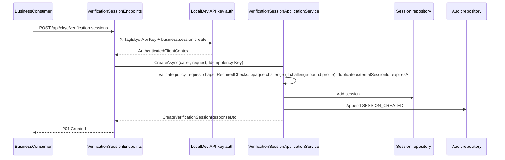
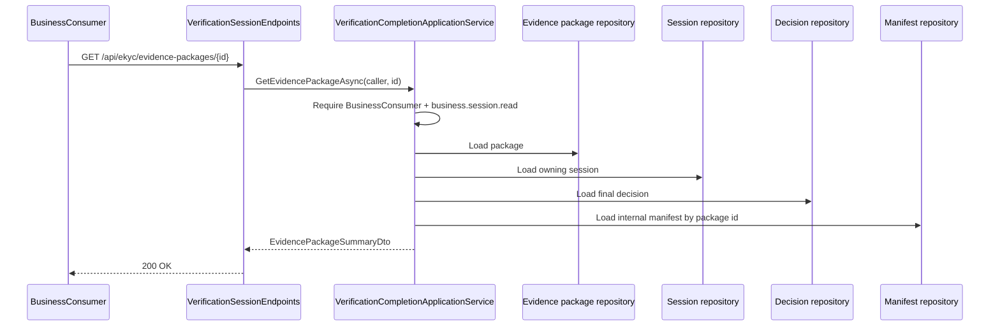
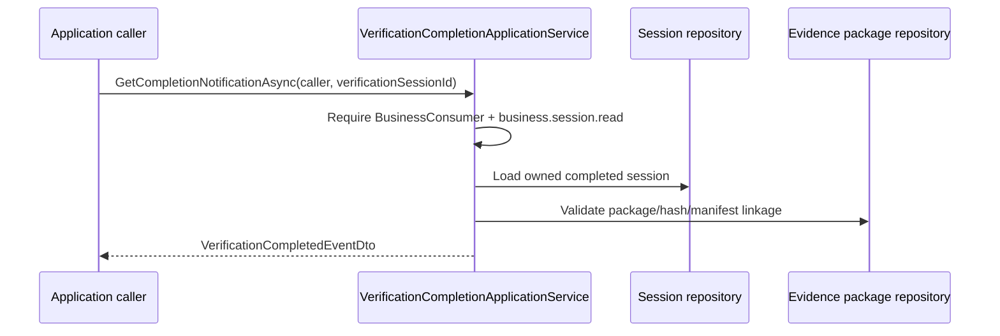

# Sequence Flows

**File:** `docs/lld_02_sequence_flows_v0_1.md`
**Version:** 0.2
**Status:** Active - S1 runtime-contract consolidation
**Date:** 2026-06-21
**Baseline:** `19666fb`
**Purpose:** Authoritative S1 sequence-flow and session-state contract for the as-built TagEkyc runtime.

## Changelog

### v0.2 - TIP-63 S1 runtime-contract consolidation

- Replaced the v0.1 sketch flows with as-built S1 flows from `VerificationSessionApplicationService`, `VerificationEvidenceApplicationService`, `VerificationCompletionApplicationService`, and `VerificationSessionEndpoints`.
- Added the complete session state-transition table for `VerificationSessionState`.
- Reconciled TIP-07/TIP-09 completion notification scope: application-service projection only, no public route, no webhook delivery.
- Corrected stale storage/vault wording: S1 public flows carry hashes, sanitized summaries, ids, and placeholder statuses; raw artifact/vault lifecycle remains outside these flows.

## 1. Source-Of-Truth Boundary

This document describes runtime behavior that is the same regardless of persistence provider. It does not define database, FK, migration, append-only, or durability facts; those belong to data/infrastructure documents.

Code wins over earlier kickoff wording. The primary code anchors are `VerificationSessionState`, `VerificationSessionApplicationService`, `VerificationEvidenceApplicationService`, `VerificationCompletionApplicationService`, `VerificationSessionEndpoints`, and the DTOs in `TagEkyc.Contracts`.

> note: TIP-06 section 20 used the stale event literal `EKYC_VERIFICATION_COMPLETED`. The as-built completion notification and completion audit event use `VERIFICATION_COMPLETED`.

## 2. Public Route Surface

Only these seven HTTP routes are public S1 routes:

| Route | Caller category | Primary service path |
| --- | --- | --- |
| `POST /api/ekyc/verification-sessions` | `BusinessConsumer` | `VerificationSessionApplicationService.CreateAsync` |
| `GET /api/ekyc/verification-sessions/{id}` | `BusinessConsumer` | `VerificationSessionApplicationService.GetSummaryAsync` |
| `POST /api/ekyc/verification-sessions/{id}/capture-artifacts` | `CaptureAgent` | `VerificationEvidenceApplicationService.AppendCaptureArtifactAsync` |
| `POST /api/ekyc/verification-sessions/{id}/evidence-results` | `TrustedAdapter` | `VerificationEvidenceApplicationService.AppendEvidenceResultAsync` |
| `POST /api/ekyc/verification-sessions/{id}/complete` | `BusinessConsumer` | `VerificationCompletionApplicationService.CompleteAsync` |
| `GET /api/ekyc/evidence-packages/{id}` | `BusinessConsumer` | `VerificationCompletionApplicationService.GetEvidencePackageAsync` |
| `GET /api/ekyc/evidence-packages/{id}/verification-view` | `BusinessConsumer` | `VerificationCompletionApplicationService.GetEvidencePackageVerificationViewAsync` (TIP-67B — neutral verifiable proof + `EvidencePackageVerificationViewDto`; summary route unchanged) |

Specialized evidence routes such as `/document-result`, `/nfc-result`, `/face-result`, `/fingerprint-result`, and `/capture-quality-result` are not mapped in S1. TIP-09 reconciles them as deferred. The implemented TrustedAdapter route is the generic `/evidence-results` route.

## 3. Create Verification Session



As-built create derives `ClientApplicationId`, caller category, scopes, and key prefix from authentication; the request body never supplies client identity. A new session starts in `Created`, with `Result = NotAvailable` and `AssuranceLevel = None`.

For `ChallengeBoundEkycProfile` (renamed from the old transaction-bound model per TIP-67A — eKYC is neutral and does NOT bind documents/transactions), the request must include an opaque `Challenge` (string, ≤128 chars, no `sha256:` prefix, not hashed/normalized — echoed verbatim, not interpreted) and may include an optional `ClientReference`. The legacy wire keys `externalTransactionId`/`bindingNonceHash` are accepted ONLY as input-compatibility aliases. `StandardEkycProfile` does not require those fields and does not default to SignFlow semantics.

## 4. Capture Artifact Submission

```mermaid
sequenceDiagram
    participant Agent as CaptureAgent
    participant Api as VerificationSessionEndpoints
    participant Auth as LocalDev API key auth
    participant Evidence as VerificationEvidenceApplicationService
    participant Artifacts as Capture artifact repository
    participant Sessions as Session repository
    participant Audit as Audit repository

    Agent->>Api: POST /api/ekyc/verification-sessions/{id}/capture-artifacts
    Api->>Auth: Authenticate API key
    Auth-->>Api: CaptureAgent caller context
    Api->>Evidence: AppendCaptureArtifactAsync(caller, id, request)
    Evidence->>Evidence: Require CaptureAgent + capture.artifact.append; load writable session
    Evidence->>Evidence: Validate captureAgentId, artifact policy, ArtifactHash/MetadataHash
    Evidence->>Artifacts: Append CaptureArtifact
    alt current state is Created
        Evidence->>Sessions: SetState(InProgress)
        Evidence->>Audit: Append SESSION_STATE_CHANGED
    end
    Evidence->>Audit: Append CAPTURE_ARTIFACT_RECORDED
    Evidence-->>Api: CaptureArtifactSubmissionResponseDto
    Api-->>Agent: 201 Created
```

Capture artifacts carry stable hash metadata (`ArtifactHash` and/or `MetadataHash`) and metadata such as `CaptureAgentId` and `DeviceId`. As-built runtime does not store or return raw artifact bytes through this route, and its current capture artifact record sets the internal `VaultRef` to null.

Capture-only writes can move `Created -> InProgress`; they cannot move a session to `ReadyToComplete`.

## 5. Trusted Evidence Result Submission

```mermaid
sequenceDiagram
    participant Adapter as TrustedAdapter
    participant Api as VerificationSessionEndpoints
    participant Evidence as VerificationEvidenceApplicationService
    participant Artifacts as Capture artifact repository
    participant Results as Evidence result repository
    participant Sessions as Session repository
    participant Audit as Audit repository

    Adapter->>Api: POST /api/ekyc/verification-sessions/{id}/evidence-results
    Api->>Evidence: AppendEvidenceResultAsync(caller, id, request)
    Evidence->>Evidence: Require TrustedAdapter + trusted.evidence.append; load writable session
    Evidence->>Artifacts: Resolve InputCaptureArtifactIds in the same session
    Evidence->>Evidence: Validate result type, compatible input artifact type, result status, confidence, PayloadHash, SanitizedSummaryRef
    Evidence->>Results: Append EvidenceResult
    alt current state is Created
        Evidence->>Sessions: SetState(InProgress)
        Evidence->>Audit: Append SESSION_STATE_CHANGED
    end
    alt latest evidence for every required check is Passed
        Evidence->>Sessions: SetState(ReadyToComplete)
        Evidence->>Audit: Append SESSION_STATE_CHANGED
    end
    Evidence->>Audit: Append EVIDENCE_RESULT_RECORDED
    Evidence-->>Api: EvidenceResultSubmissionResponseDto
    Api-->>Adapter: 201 Created
```

The route accepts `EvidenceResultType` values for capture quality, document OCR, NFC validation, face match, liveness, fingerprint match, and fraud risk. As-built runtime rejects `FraudRisk` with `FRAUD_RISK_DEFERRED`; it also rejects `NotAvailable` and `NotSupported` evidence result statuses.

Readiness uses latest accepted evidence by append order. `ReadyToComplete` requires a latest `Passed` evidence result for every required check. `ReviewRequired`, `RetryRequired`, `FailedCaptureQuality`, `FailedIdentity`, and `TechnicalError` can be recorded, but do not satisfy readiness.

## 6. Complete Verification Session

```mermaid
sequenceDiagram
    participant Client as BusinessConsumer
    participant Api as VerificationSessionEndpoints
    participant Completion as VerificationCompletionApplicationService
    participant Results as Evidence result repository
    participant Boundary as Finalization boundary
    participant Package as Package/manifest projection
    participant Audit as Audit repository

    Client->>Api: POST /api/ekyc/verification-sessions/{id}/complete
    Api->>Completion: CompleteAsync(caller, id, request)
    Completion->>Completion: Require BusinessConsumer + session.complete; load owned session
    alt session already Completed
        Completion-->>Api: existing completed snapshot
    else session expired or terminal
        Completion-->>Api: error
    else active session
        Completion->>Results: Load latest required evidence
        Completion->>Completion: Calculate final result and assurance level
        Completion->>Package: Build decision, evidence package, manifest refs, hashes; sign neutral proof (TIP-66/67B real ES256 JWS → status Signed; legacy = PlaceholderUnverified)
        Completion->>Audit: Prepare VERIFICATION_COMPLETED audit event
        Completion->>Boundary: TryFinalizeAsync(expected, completed, decision, package, manifest, audit)
        Boundary-->>Completion: Applied / AlreadyCompleted / NotFound / conflict
        Completion-->>Api: CompleteVerificationSessionResponseDto
    end
    Api-->>Client: 200 OK or error envelope
```

Completion is idempotent for already completed sessions after authentication, scope, and ownership succeed. A completed retry returns the existing completed snapshot rather than creating another decision/package.

Final result precedence is:

1. `ForceReview` request flag or any selected latest evidence `ReviewRequired` -> `ReviewRequired`.
2. Any selected latest evidence `TechnicalError` -> `TechnicalError`.
3. Any selected latest evidence `RetryRequired` -> `RetryRequired`.
4. Any selected latest evidence `FailedCaptureQuality` -> `FailedCaptureQuality`.
5. Any selected latest evidence `FailedIdentity` -> `FailedIdentity`.
6. Otherwise -> `Passed`.

Assurance level is `Unknown` for `TechnicalError`, `Low` for other non-passed outcomes, `High` when a passed session includes DocumentNfc + FaceMatch + Liveness, and `Medium` for other passed sessions.

The completion audit event type is `VERIFICATION_COMPLETED`. The completion response exposes final decision id, evidence package id, evidence package hash, manifest hash, effective request/correlation ids, completedAt, and the evidence package signature status (`Signed` for TIP-66/TIP-67B packages, `PlaceholderUnverified` for legacy/pre-signing packages). The completion response does NOT expose the JWS value, signature envelope, or key material (those are on the dedicated `/verification-view` route).

## 7. Evidence Package Read



The default BusinessConsumer evidence package summary is sanitized. It exposes package id, session id, package version, package hash, manifest hash, final result, assurance level, public evidence refs, signature status, request/correlation ids, and completedAt. Public evidence refs expose result type, evidence result id, compatibility aliases, and artifact hash only.

## 8. Completion Notification Projection



The completion notification is an application-query projection only. No public HTTP route, webhook endpoint, dispatcher, retry route, delivery ledger, subscription model, or external HTTP delivery exists in S1.

The projection maps `EventType = "VERIFICATION_COMPLETED"`, `DeliveryId = "localdev-not-dispatched"`, `SentAt = CompletedAt`, `ClientApplicationId`, result, assurance, evidence package id/hash, manifest hash, request/correlation ids, completedAt, `WebhookSignatureStatus = PlaceholderUnverified`, and evidence package signature status from the completed session/package state.

## 9. Session State-Transition Table

| State | Meaning | Legal entry trigger(s) | Legal exit trigger(s) | Write rejection behavior |
| --- | --- | --- | --- | --- |
| `Created` | Session accepted; no accepted capture/evidence write has moved it forward. | `CreateAsync` creates every new session in `Created`. | Capture artifact append -> `InProgress`; evidence result append -> `InProgress` and possibly same-write `ReadyToComplete`; successful completion -> `Completed` only if required evidence already exists. | If `ExpiresAt <= now`, capture/evidence reject `SESSION_EXPIRED` 403 and complete rejects `SESSION_EXPIRED` 403. Completion without required evidence rejects `REQUIRED_EVIDENCE_MISSING` 409. |
| `InProgress` | At least one capture/evidence write exists, but latest required evidence does not yet all pass. | Capture append from `Created`; evidence append from `Created`. | Evidence append that makes all latest required evidence `Passed` -> `ReadyToComplete`; successful completion can still proceed if required evidence exists and validation passes. | Same expiry behavior. Completion with missing required evidence rejects `REQUIRED_EVIDENCE_MISSING` 409. |
| `ReadyToComplete` | Latest evidence for every required check is `Passed`; no more TIP-05 writes accepted. | Evidence append from `Created` or `InProgress` when all latest required evidence is `Passed`. | Successful completion -> `Completed`. | Capture/evidence writes reject `SESSION_READY_TO_COMPLETE` 409. Complete can proceed unless expired. |
| `Completed` | Final decision, evidence package, package hash, manifest hash, and completedAt are present. | `CompleteAsync` finalization succeeds or the finalization boundary reports already completed with a snapshot. | None in S1. | Capture/evidence writes reject `SESSION_TERMINAL` 409. Complete returns the existing completed snapshot after auth/scope/ownership. Completion notification projection is allowed only for this state. |
| `Expired` | Terminal state value reserved for expired sessions. | No public route currently mutates active sessions into `Expired`; write paths also treat `ExpiresAt <= now` as expired. | None in S1. | Capture/evidence writes reject `SESSION_EXPIRED` 403 when wall-clock expiry is reached, or `SESSION_TERMINAL` 409 if state is already `Expired`; complete rejects `SESSION_EXPIRED` 403. |
| `Cancelled` | Terminal state value reserved for cancellation. | No public S1 route sets this state. | None in S1. | Capture/evidence writes reject `SESSION_TERMINAL` 409. Complete rejects `SESSION_TERMINAL` 409. |
| `TechnicalTerminal` | Terminal state value reserved for unrecoverable technical termination. | No public S1 route sets this state. | None in S1. | Capture/evidence writes reject `SESSION_TERMINAL` 409. Complete rejects `SESSION_TERMINAL` 409. |

Terminal set for write rejection is `Completed`, `Expired`, `Cancelled`, and `TechnicalTerminal`; `ReadyToComplete` is not terminal, but it is closed to further capture/evidence writes.

## 10. Failure And Deferred Runtime Boundaries

```mermaid
sequenceDiagram
    participant Actor as Caller
    participant Api as VerificationSessionEndpoints
    participant Service as Application service

    Actor->>Api: S1 request
    Api->>Service: Authenticated command/query
    alt auth, scope, category, ownership, shape, policy, state, or evidence validation fails
        Service-->>Api: SessionOperationError(code, message, status)
        Api-->>Actor: ErrorEnvelope
    else valid command/query
        Service-->>Api: DTO
        Api-->>Actor: Success response
    end
```

S1 does not implement a scheduler that scans and transitions expired sessions, production webhook delivery or retry, specialized evidence HTTP routes, production vault/storage behavior, production signature verification, or SignFlow runtime integration. Future work must open a later reviewed slice instead of treating those as part of this LLD flow.
