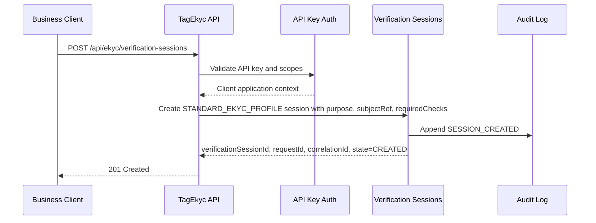
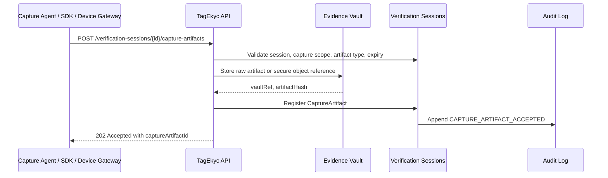
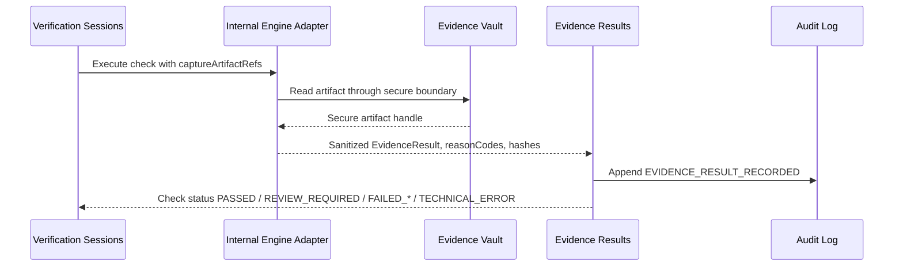
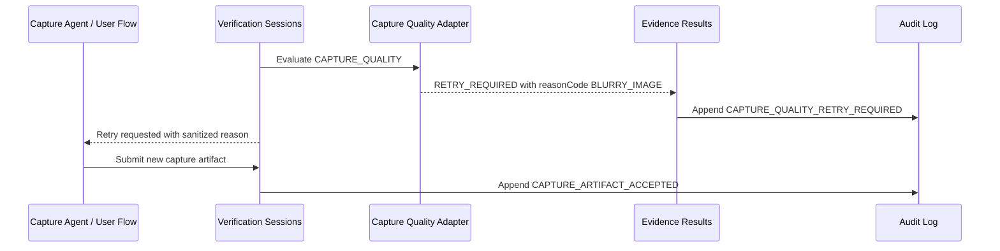
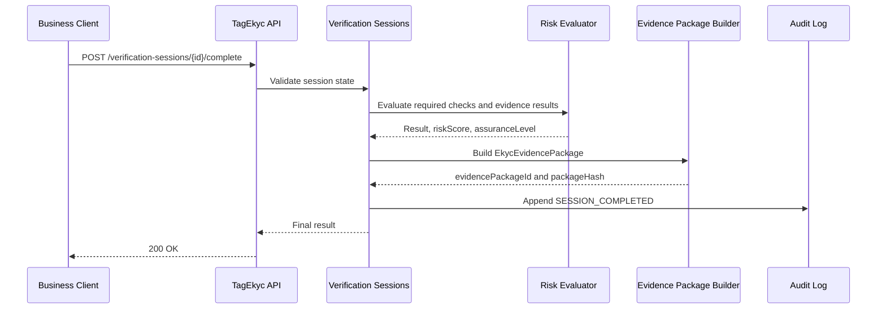
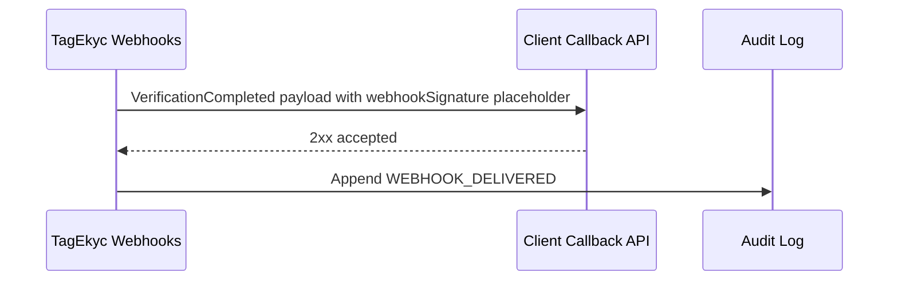
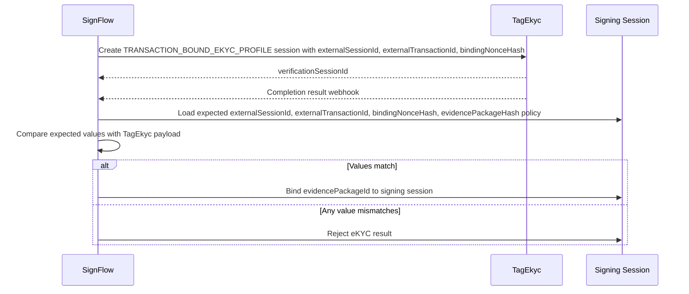
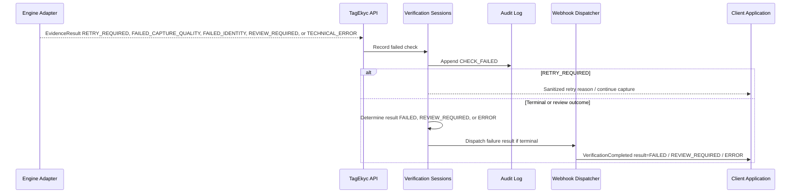
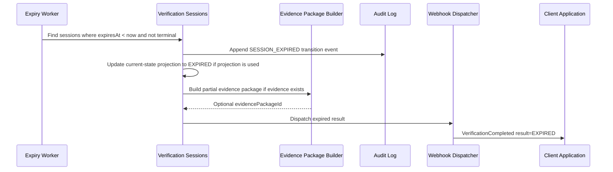

# Sequence Flows v0.1

## Create Generic Verification Session

Generic session creation MUST derive `clientApplicationId` from authentication. Generic platform requests do not default to `externalSystem = SignFlow`, `purpose = SIGNING_AUTH`, or mandatory `bindingNonceHash`.

## Capture Artifact Submission

Capture artifacts are inputs such as document images, selfie images, liveness media, NFC read artifacts, fingerprint captures, and device metadata. Raw artifacts remain inside vault or secure adapter boundaries.

## Internal Adapter Processing Artifact Into Evidence Result

Adapters convert artifacts into evidence results such as OCR, NFC validation, face match, liveness, fingerprint match, fraud/risk, and capture quality. Business clients do not submit arbitrary `PASSED` evidence.

## Capture Quality Retry Flow

`RETRY_REQUIRED` means the artifact quality is insufficient and the user/operator should capture again. `FAILED_CAPTURE_QUALITY` means the artifact cannot be used. These are distinct from `FAILED_IDENTITY`, `REVIEW_REQUIRED`, and `TECHNICAL_ERROR`.

## Complete Verification Session

## Webhook Callback To Business Client

Future production `webhookSignature` SHOULD include delivery id, timestamp, and replay protection.

## Transaction-Bound SignFlow Binding Validation

SignFlow is the first named transaction-bound consumer profile. `purpose = SIGNING_AUTH` and `bindingNonceHash` are SignFlow/transaction-bound requirements, not generic platform defaults.

## Failure Flow

## Timeout / Expired Flow

