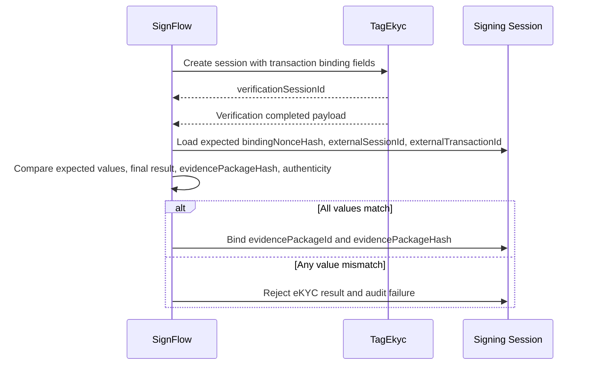

# SignFlow Integration Contract v0.1

## Purpose

This contract defines how SignFlow consumes TagEkyc as an independent identity assurance provider. TagEkyc MUST remain independent from SignFlow code and database. SignFlow integration is one consumer contract, not a product dependency.

SignFlow uses `TRANSACTION_BOUND_EKYC_PROFILE`. It is the first named transaction-bound consumer profile, not the generic TagEkyc platform model.

## Responsibility Split

- TagEkyc MUST prove who the person is.
- SignFlow MUST prove what the person saw and agreed to sign.
- `bindingNonce` MUST bind identity verification and signing consent to the same transaction context.

## Create eKYC Verification Session

SignFlow creates a verification session before or during a signing authentication flow.

Required request fields:

- `externalSessionId`
- `externalTransactionId`
- `subjectRef`
- `purpose = SIGNING_AUTH`
- `profile = TRANSACTION_BOUND_EKYC_PROFILE`
- `bindingNonceHash`
- `requiredChecks`

`externalSystem = SignFlow`, if represented in an API or payload, MUST be derived from or validated against the authenticated `clientApplicationId`.

Request sample:

```json
{
  "externalSessionId": "sf_session_123",
  "externalTransactionId": "sf_tx_456",
  "subjectRef": "patient_789",
  "purpose": "SIGNING_AUTH",
  "profile": "TRANSACTION_BOUND_EKYC_PROFILE",
  "bindingNonceHash": "sha256:abc123",
  "requiredChecks": [
    { "checkType": "CAPTURE_QUALITY", "required": true },
    { "checkType": "DOCUMENT_NFC", "required": true },
    { "checkType": "FACE_MATCH", "required": true },
    { "checkType": "LIVENESS", "required": true },
    { "checkType": "FINGERPRINT", "required": false }
  ]
}
```

Response sample:

```json
{
  "verificationSessionId": "vs_01HY",
  "profile": "TRANSACTION_BOUND_EKYC_PROFILE",
  "state": "CREATED",
  "result": "NOT_AVAILABLE"
}
```

## Completion Result Fields

TagEkyc sends or returns a sanitized result payload.

Required result fields:

- `verificationSessionId`
- `externalSystem`
- `externalSessionId`
- `externalTransactionId`
- `bindingNonceHash`
- `result`
- `assuranceLevel`
- `evidencePackageId`
- `evidencePackageHash`
- `documentResult`
- `biometricResult`
- `completedAt`
- `webhookSignature` placeholder when delivered by webhook
- `payloadSignature` placeholder when using signed direct payloads

The related evidence package MAY include `evidencePackageSignature` as a separate long-term audit signature placeholder.

Webhook payload sample:

```json
{
  "eventType": "EKYC_VERIFICATION_COMPLETED",
  "deliveryId": "whd_01HY",
  "sentAt": "2026-05-24T09:20:01Z",
  "verificationSessionId": "vs_01HY",
  "externalSystem": "SignFlow",
  "externalSessionId": "sf_session_123",
  "externalTransactionId": "sf_tx_456",
  "bindingNonceHash": "sha256:abc123",
  "result": "PASSED",
  "assuranceLevel": "MEDIUM",
  "evidencePackageId": "ep_01HY",
  "evidencePackageHash": "sha256:package",
  "documentResult": {
    "result": "PASSED",
    "documentType": "CCCD",
    "nfcResult": "PASSED",
    "documentEvidenceRef": "doc_ev_01HY",
    "nfcEvidenceRef": "nfc_ev_01HY"
  },
  "biometricResult": {
    "faceMatchResult": "PASSED",
    "livenessResult": "PASSED",
    "fingerprintResult": "NOT_REQUIRED"
  },
  "completedAt": "2026-05-24T09:20:00Z",
  "webhookSignature": "placeholder"
}
```

## Binding Validation Rule

SignFlow MUST reject the TagEkyc result if any of these values do not match the expected signing transaction:

- `bindingNonceHash`
- `externalSessionId`
- `externalTransactionId`
- final `result`
- `evidencePackageHash`
- webhook/result authenticity when implemented

SignFlow MUST NOT bind `evidencePackageId` to a signing session until the binding validation succeeds.

Validation flow:



## Raw Data Restrictions

The SignFlow payload MUST NOT include:

- Raw CCCD image
- Raw CCCD plaintext extracted fields
- Raw NFC data groups
- Raw face image
- Raw liveness video/image
- Raw fingerprint image
- Raw fingerprint template

SignFlow payloads MUST use:

- `evidencePackageId`
- `evidencePackageHash`
- Evidence refs
- Artifact hashes
- Sanitized result summaries

SignFlow default payloads MUST NOT include internal VaultRefs. Any future VaultRef exposure requires explicit evidence-access policy, scoped authorization, and audit. VaultRef exposure is outside the S1 default SignFlow flow.

## Failure Handling

If TagEkyc returns `FAILED`, `REVIEW_REQUIRED`, `EXPIRED`, or `ERROR`, SignFlow SHOULD treat the identity assurance step as not passed for signing authorization unless a separate business policy explicitly allows manual review.

Failure payload sample:

```json
{
  "eventType": "EKYC_VERIFICATION_COMPLETED",
  "deliveryId": "whd_01HZ",
  "sentAt": "2026-05-24T09:20:01Z",
  "verificationSessionId": "vs_01HY",
  "externalSystem": "SignFlow",
  "externalSessionId": "sf_session_123",
  "externalTransactionId": "sf_tx_456",
  "bindingNonceHash": "sha256:abc123",
  "result": "FAILED",
  "assuranceLevel": "NONE",
  "evidencePackageId": "ep_01HZ",
  "evidencePackageHash": "sha256:failedpackage",
  "documentResult": {
    "result": "PASSED",
    "documentType": "CCCD",
    "nfcResult": "PASSED"
  },
  "biometricResult": {
    "faceMatchResult": "FAILED",
    "livenessResult": "PASSED",
    "fingerprintResult": "NOT_REQUIRED"
  },
  "reasonCodes": ["FAILED_IDENTITY"],
  "completedAt": "2026-05-24T09:20:00Z",
  "webhookSignature": "placeholder"
}
```

Capture quality payloads SHOULD distinguish `RETRY_REQUIRED` and `FAILED_CAPTURE_QUALITY` from `FAILED_IDENTITY`. A blurry image, poor selfie, weak NFC read, or low-quality fingerprint capture is not the same as identity mismatch.

## Security Notes

- SignFlow SHOULD verify webhook signatures when implemented.
- Future webhook signatures SHOULD include delivery id, timestamp, and replay protection.
- SignFlow SHOULD store the `evidencePackageId`, `evidencePackageHash`, and completion timestamp with the signing session audit trail.
- SignFlow MUST NOT use TagEkyc results from another `externalSessionId` or `externalTransactionId`.
- TagEkyc MUST NOT require access to SignFlow signing document content.
