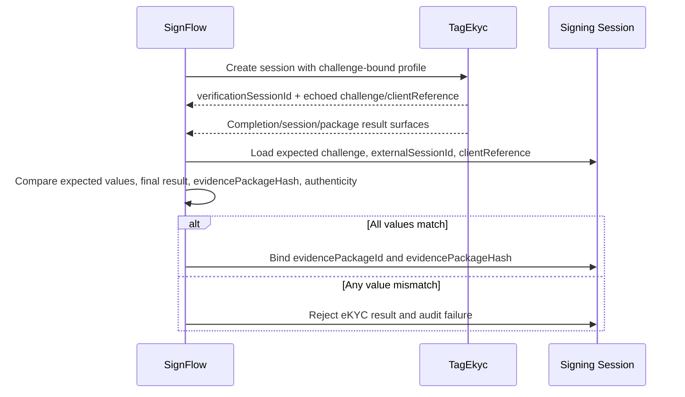

# SignFlow Integration Contract v0.1

## Purpose

This contract defines how SignFlow consumes TagEkyc as an independent identity assurance provider. TagEkyc MUST remain independent from SignFlow code, signing documents, and database. SignFlow integration is one consumer contract, not a product dependency.

SignFlow uses the neutral `CHALLENGE_BOUND_EKYC_PROFILE`. The challenge is an opaque client-provided string that TagEkyc echoes for the client to bind to its own signing session. TagEkyc does not interpret the challenge as a transaction, document, consent, or nonce hash.

## Responsibility Split

- TagEkyc proves who the person is.
- SignFlow proves what the person saw and agreed to sign.
- SignFlow creates and validates its own binding material.
- TagEkyc stores and echoes `challenge` and optional `clientReference` verbatim, subject only to string-safety limits.

## Create eKYC Verification Session

SignFlow creates a verification session before or during a signing authentication flow.

Required request fields for the challenge-bound profile:

- `externalSessionId`
- `clientReference` (optional but recommended for SignFlow correlation)
- `subjectRef`
- `purpose = SIGNING_AUTH`
- `profile = CHALLENGE_BOUND_EKYC_PROFILE`
- `challenge`
- `requiredChecks`

The `challenge` value is opaque and MUST be 128 .NET characters or fewer, MUST NOT contain C0/C1 control characters, and MUST NOT be trimmed, normalized, hashed, or interpreted by TagEkyc. Legacy input field keys `externalTransactionId` and `bindingNonceHash`, plus legacy profile value `TRANSACTION_BOUND_EKYC_PROFILE`, are accepted only for compatibility and are emitted back using the neutral names/profile.

Request sample:

```json
{
  "externalSessionId": "sf_session_123",
  "clientReference": "sf_ref_456",
  "subjectRef": "patient_789",
  "purpose": "SIGNING_AUTH",
  "profile": "CHALLENGE_BOUND_EKYC_PROFILE",
  "challenge": "opaque-signflow-challenge-01",
  "requiredChecks": [
    { "checkType": "CaptureQuality", "required": true },
    { "checkType": "DocumentNfc", "required": true },
    { "checkType": "FaceMatch", "required": true },
    { "checkType": "Liveness", "required": true }
  ]
}
```

Create response sample:

```json
{
  "verificationSessionId": "vs_01HY",
  "profile": "CHALLENGE_BOUND_EKYC_PROFILE",
  "state": "Created",
  "result": "NotAvailable",
  "challenge": "opaque-signflow-challenge-01",
  "clientReference": "sf_ref_456"
}
```

## Completion Result Fields

TagEkyc returns sanitized result data. The default completion-notification projection is notification-only; SignFlow should verify package data by reading the package/session surfaces available to it.

Required values for SignFlow binding:

- `verificationSessionId`
- `externalSessionId`
- `clientReference`
- `challenge`
- final `result`
- `assuranceLevel`
- `evidencePackageId`
- `evidencePackageHash`
- `manifestHash`
- evidence/package authenticity through the verification view

`challenge` and `clientReference` are echoed on `CreateVerificationSessionResponseDto`, `VerificationSessionSummaryDto`, and `CompleteVerificationSessionResponseDto`. They are response DTO fields only. They are not part of the S1 `manifestBodyHash`, `packageHash`, or `manifestHash` chain.

## Verification View And Signed Proof

After completion, SignFlow SHOULD read:

```text
GET /api/ekyc/evidence-packages/{evidencePackageId}/verification-view
```

The view exposes a neutral signed proof claim, the attached compact JWS, the sign-time public JWK, and `publicKeyFingerprint`. The test verifier `Tip67BReferenceVerifier` is the executable mirror of this contract, but SignFlow MUST be able to implement verification from this section alone.

### JWS And Trust Anchor

`signatureValue` is an attached compact JWS:

```text
base64url(protected-header).base64url(payload).base64url(signature)
```

The protected header is a JCS-canonical JSON object with:

| Field | Required value |
| --- | --- |
| `alg` | `ES256` |
| `kid` | The signing key id |

The verification trust anchor is out-of-band configuration, not the embedded JWK alone:

- expected `kid`
- expected `publicKeyFingerprint`
- the retained historical set of previously trusted (`kid`, `publicKeyFingerprint`) pairs until the retention period for packages signed by those keys expires

`publicKeyFingerprint` is:

```text
sha256:<lowercase-hex>
```

computed over the UTF-8 bytes of the RFC 8785 JCS canonical public JWK object:

```json
{ "kty": "EC", "crv": "P-256", "x": "...", "y": "..." }
```

The embedded `publicKeyJwk` MUST contain only `kty`, `crv`, `x`, and `y`. It MUST NOT contain private `d`, certificate material, P12 material, key operations, or any other field. SignFlow MUST reject the view unless the embedded public JWK canonicalizes to the pinned fingerprint.

### Key Rotation And Trust-Anchor History

TIP-68 keeps JWKS/public discovery deferred. Historical verification therefore relies on the sign-time key material embedded in each package envelope, but that embedded key is not a trust anchor by itself.

When TagEkyc rotates the current signing key:

- TagEkyc issues a rotation notice containing the new `kid` and `publicKeyFingerprint`.
- SignFlow adds the new (`kid`, `publicKeyFingerprint`) pair to its out-of-band pinned anchor set before accepting packages signed by the new key.
- SignFlow retains old (`kid`, `publicKeyFingerprint`) pairs in that pinned anchor set until the retention period for packages signed by those keys expires.
- A historical package verifies only if its embedded `publicKeyJwk` canonicalizes to a fingerprint that matches a retained pinned pair for its `kid`.
- SignFlow MUST NOT replace this retained anchor-set check with "trust whatever public key is embedded in the package."

This preserves the TIP-67B invariant that old packages verify via their persisted sign-time key while preserving the trust invariant that the persisted key must still match a pinned historical trust anchor.

### Verification Algorithm

SignFlow MUST verify in this order and fail closed on the first mismatch:

1. Require known proof/signature metadata: `proofVersion = neutral-proof-v1`, `signatureFormat = JWS`, `signatureScheme = jws-es256-v1`, `signatureAlgorithm = ES256`.
2. Split `signatureValue` into exactly three compact-JWS segments.
3. Decode the protected header and require `alg == signatureAlgorithm == ES256`.
4. Require `kid == keyId == pinned kid`.
5. Canonicalize `publicKeyJwk` as `{kty,crv,x,y}` and require its `sha256` fingerprint to equal both the view `publicKeyFingerprint` and the pinned fingerprint.
6. Reject `publicKeyJwk` if it contains private `d` or any field outside `{kty,crv,x,y}`.
7. Import the public key as P-256 ECDSA and verify `signature` over the ASCII bytes of `base64url(header) + "." + base64url(payload)` using SHA-256 and ES256/P1363 signature format.
8. Decode the JWS payload and read verification facts only from the decoded signed claim.
9. Require every mirrored view field to equal the decoded claim field.
10. Recompute `resultHash` from the decoded claim and require equality.
11. Require the decoded signed `challenge` to equal the expected challenge for the SignFlow signing session.

`clientReference` is an unsigned correlation echo. It is useful for lookup and audit, but it is not a signed proof fact.

### Signed Claim Fields

The signed payload is a JCS-canonical JSON claim containing:

- `proofVersion`
- `purpose`
- `sessionId`
- `identityRef`
- `packageId`
- `packageVersion`
- `canonicalizationScheme`
- `hashAlgorithm`
- `result`
- `assuranceLevel`
- `requiredChecks`
- `completedChecks`
- `evidenceEngines`
- `signedAt`
- `challenge`
- `signedManifestHash`
- `resultHash`
- `resultHashAlgorithm`
- `resultHashCanonicalizationScheme`

`identityRef` is always hashed by TagEkyc; raw `subjectRef` is not exposed in the view or JWS.

`requiredChecks` and `completedChecks` are sorted deterministically by enum-name ordinal string order before signing and resultHash computation.

`evidenceEngines[]` entries are ordered by `evidenceResultType` and then `evidenceResultId`. Each entry contains `evidenceResultType`, `evidenceResultId`, `engineName`, `engineVersion`, and `checkType`.

### Result Hash

`resultHash` protects the signed result sub-claim and is recomputed by SignFlow from the decoded claim. It is:

```text
sha256:<lowercase-hex>
```

over the UTF-8 bytes:

```text
tip-67b-neutral-proof-result
{rfc8785-jcs-json-preimage}
```

The preimage field list is:

```text
proofVersion
purpose
sessionId
identityRef
packageId
packageVersion
canonicalizationScheme
hashAlgorithm
result
assuranceLevel
requiredChecks
completedChecks
evidenceEngines
signedAt
challenge
signedManifestHash
```

The preimage explicitly excludes `resultHash`, `resultHashAlgorithm`, `resultHashCanonicalizationScheme`, and `signatureValue`.

### Fail-Closed Matrix

SignFlow MUST reject:

- unknown `proofVersion`, `signatureFormat`, `signatureScheme`, or `signatureAlgorithm`
- malformed compact JWS or invalid base64url segment
- header `alg` mismatch
- header `kid` mismatch
- view `keyId` mismatch against the pinned `kid`
- embedded `publicKeyJwk` fingerprint mismatch
- embedded `publicKeyJwk` containing private `d` or any unsupported field
- forged JWS signed by an attacker key even when the attacker JWK is embedded
- corrupted JWS signature bytes under the correct pinned key
- tampered payload, malformed payload, or ECDSA verification failure
- mirrored view field mismatch against the decoded claim
- recomputed `resultHash` mismatch
- decoded `challenge` mismatch against the expected SignFlow challenge
- any use of unsigned view fields as proof facts when they differ from the decoded claim

## Binding Validation Rule

SignFlow MUST reject the TagEkyc result if any of these values do not match its expected signing session:

- `challenge`
- `externalSessionId`
- `clientReference` when supplied
- final `result`
- `evidencePackageHash`
- JWS signature, pinned key id/fingerprint, mirrored view fields, and recomputed `resultHash`

SignFlow MUST NOT bind `evidencePackageId` to a signing session until this client-side validation succeeds.

After the TagEkyc proof verifies, document/signing-session binding remains SignFlow's job. A recommended binding input is:

```text
H(challenge || document_hash || resultHash)
```

TagEkyc does not bind documents, transactions, consents, or signing payloads.

Validation flow:



## Raw Data Restrictions

The SignFlow payload MUST NOT include:

- Raw CCCD image
- Raw CCCD plaintext extracted fields
- Raw NFC data groups
- Raw face image
- Raw liveness video/image
- Raw fingerprint image
- Raw fingerprint template

SignFlow payloads MUST use:

- `evidencePackageId`
- `evidencePackageHash`
- `manifestHash`
- Evidence refs
- Artifact hashes
- Sanitized result summaries
- Client-owned correlation fields

SignFlow default payloads MUST NOT include internal VaultRefs. Any future VaultRef exposure requires explicit evidence-access policy, scoped authorization, and audit. VaultRef exposure is outside the S1 default SignFlow flow.

## Failure Handling

If TagEkyc returns `FailedIdentity`, `ReviewRequired`, `Expired`, or `TechnicalError`, SignFlow SHOULD treat the identity assurance step as not passed for signing authorization unless a separate business policy explicitly allows manual review.

Capture quality payloads SHOULD distinguish `RetryRequired` and `FailedCaptureQuality` from identity mismatch.

## Security Notes

- SignFlow SHOULD verify webhook/package signatures when implemented.
- Future webhook signatures SHOULD include delivery id, timestamp, and replay protection.
- SignFlow SHOULD store the `evidencePackageId`, `evidencePackageHash`, `manifestHash`, completion timestamp, challenge, and client reference with the signing session audit trail.
- SignFlow MUST NOT use TagEkyc results from another `externalSessionId`, `clientReference`, or `challenge`.
- TagEkyc MUST NOT require access to SignFlow signing document content.
