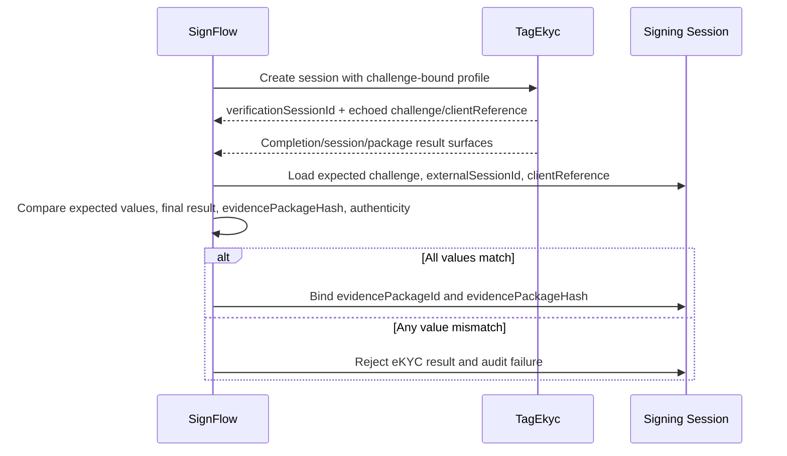

# SignFlow Integration Contract v0.1

## Purpose

This contract defines how SignFlow consumes TagEkyc as an independent identity assurance provider. TagEkyc MUST remain independent from SignFlow code, signing documents, and database. SignFlow integration is one consumer contract, not a product dependency.

SignFlow uses the neutral `CHALLENGE_BOUND_EKYC_PROFILE`. The challenge is an opaque client-provided string that TagEkyc echoes for the client to bind to its own signing session. TagEkyc does not interpret the challenge as a transaction, document, consent, or nonce hash.

## Responsibility Split

- TagEkyc proves who the person is.
- SignFlow proves what the person saw and agreed to sign.
- SignFlow creates and validates its own binding material.
- TagEkyc stores and echoes `challenge` and optional `clientReference` verbatim, subject only to string-safety limits.

## Create eKYC Verification Session

SignFlow creates a verification session before or during a signing authentication flow.

Required request fields for the challenge-bound profile:

- `externalSessionId`
- `clientReference` (optional but recommended for SignFlow correlation)
- `subjectRef`
- `purpose = SIGNING_AUTH`
- `profile = CHALLENGE_BOUND_EKYC_PROFILE`
- `challenge`
- `requiredChecks`

The `challenge` value is opaque and MUST be 128 .NET characters or fewer, MUST NOT contain C0/C1 control characters, and MUST NOT be trimmed, normalized, hashed, or interpreted by TagEkyc. Legacy input field keys `externalTransactionId` and `bindingNonceHash`, plus legacy profile value `TRANSACTION_BOUND_EKYC_PROFILE`, are accepted only for compatibility and are emitted back using the neutral names/profile.

Request sample:

```json
{
  "externalSessionId": "sf_session_123",
  "clientReference": "sf_ref_456",
  "subjectRef": "patient_789",
  "purpose": "SIGNING_AUTH",
  "profile": "CHALLENGE_BOUND_EKYC_PROFILE",
  "challenge": "opaque-signflow-challenge-01",
  "requiredChecks": [
    { "checkType": "CaptureQuality", "required": true },
    { "checkType": "DocumentNfc", "required": true },
    { "checkType": "FaceMatch", "required": true },
    { "checkType": "Liveness", "required": true }
  ]
}
```

Create response sample:

```json
{
  "verificationSessionId": "vs_01HY",
  "profile": "CHALLENGE_BOUND_EKYC_PROFILE",
  "state": "Created",
  "result": "NotAvailable",
  "challenge": "opaque-signflow-challenge-01",
  "clientReference": "sf_ref_456"
}
```

## Completion Result Fields

TagEkyc returns sanitized result data. The default completion-notification projection is notification-only; SignFlow should verify package data by reading the package/session surfaces available to it.

Required values for SignFlow binding:

- `verificationSessionId`
- `externalSessionId`
- `clientReference`
- `challenge`
- final `result`
- `assuranceLevel`
- `evidencePackageId`
- `evidencePackageHash`
- `manifestHash`
- evidence/package authenticity when implemented

`challenge` and `clientReference` are echoed on `CreateVerificationSessionResponseDto`, `VerificationSessionSummaryDto`, and `CompleteVerificationSessionResponseDto`. They are response DTO fields only. They are not part of the S1 `manifestBodyHash`, `packageHash`, or `manifestHash` chain.

## Binding Validation Rule

SignFlow MUST reject the TagEkyc result if any of these values do not match its expected signing session:

- `challenge`
- `externalSessionId`
- `clientReference` when supplied
- final `result`
- `evidencePackageHash`
- package/result authenticity when implemented

SignFlow MUST NOT bind `evidencePackageId` to a signing session until this client-side validation succeeds.

Validation flow:



## Raw Data Restrictions

The SignFlow payload MUST NOT include:

- Raw CCCD image
- Raw CCCD plaintext extracted fields
- Raw NFC data groups
- Raw face image
- Raw liveness video/image
- Raw fingerprint image
- Raw fingerprint template

SignFlow payloads MUST use:

- `evidencePackageId`
- `evidencePackageHash`
- `manifestHash`
- Evidence refs
- Artifact hashes
- Sanitized result summaries
- Client-owned correlation fields

SignFlow default payloads MUST NOT include internal VaultRefs. Any future VaultRef exposure requires explicit evidence-access policy, scoped authorization, and audit. VaultRef exposure is outside the S1 default SignFlow flow.

## Failure Handling

If TagEkyc returns `FailedIdentity`, `ReviewRequired`, `Expired`, or `TechnicalError`, SignFlow SHOULD treat the identity assurance step as not passed for signing authorization unless a separate business policy explicitly allows manual review.

Capture quality payloads SHOULD distinguish `RetryRequired` and `FailedCaptureQuality` from identity mismatch.

## Security Notes

- SignFlow SHOULD verify webhook/package signatures when implemented.
- Future webhook signatures SHOULD include delivery id, timestamp, and replay protection.
- SignFlow SHOULD store the `evidencePackageId`, `evidencePackageHash`, `manifestHash`, completion timestamp, challenge, and client reference with the signing session audit trail.
- SignFlow MUST NOT use TagEkyc results from another `externalSessionId`, `clientReference`, or `challenge`.
- TagEkyc MUST NOT require access to SignFlow signing document content.
