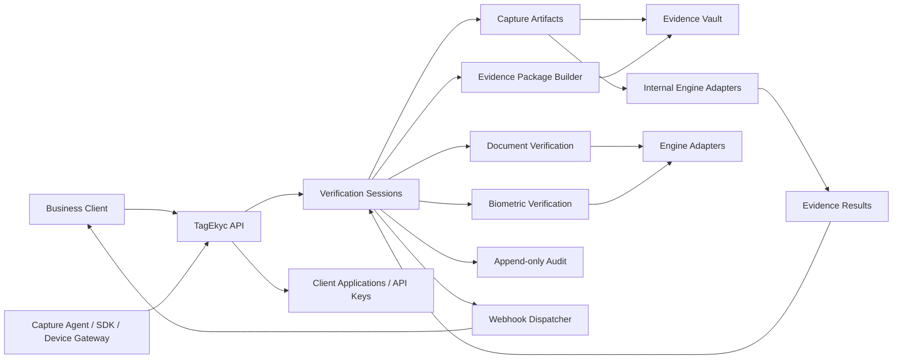

# TagEkyc High-Level Design v0.1

## Product Purpose

TagEkyc is an independent eKYC and identity assurance platform. It verifies identity evidence from documents, CCCD/NFC, face match, liveness, fingerprint, and risk signals, then produces auditable evidence packages for external systems.

TagEkyc MUST answer who the person is. It MUST NOT answer what document the person agreed to sign.

## Non-Goals

- TagEkyc MUST NOT perform document signing, transaction-consent signing, qualified digital signing, or non-repudiation signing for SignFlow. TagEkyc MAY sign its own eKYC proof/evidence envelope for integrity, origin identification, and audit verification.
- TagEkyc MUST NOT render signing documents for consent.
- TagEkyc MUST NOT depend on SignFlow internals.
- TagEkyc MUST NOT expose raw sensitive evidence to consumers by default.
- S1 MUST NOT claim production legal certification, regulatory approval, or production biometric assurance.

## Target Consumers

- SignFlow
- Hospital Information Systems
- Patient Portal applications
- Registration and onboarding portals
- Internal operator tools
- Other client applications requiring identity assurance

TagEkyc also distinguishes caller roles. Business clients create sessions and consume sanitized results. Capture agents, SDKs, and device gateways submit captured artifacts under separate scopes. Internal adapters process artifacts into evidence results inside secure boundaries. Operator/admin tools are privileged operational callers.

## High-Level Architecture

## Suggested Bounded Contexts / Modules

### Tenancy / Client Applications

Manages external client applications, API keys, permissions, webhook subscriptions, allowed purposes, and callback configuration. It SHOULD isolate sessions by client application.

### Verification Sessions

Owns lifecycle, state transitions, RequiredChecks policy, profile, external correlation fields, captured artifacts, verification checks, evidence results, evidence package, callbacks/webhooks, expiry, and final decision assembly. `VerificationSession` is the root business correlation object, not merely a technical session id. It MUST use explicit state and result enums.

`STANDARD_EKYC_PROFILE` is the generic platform profile for ordinary identity assurance. `CHALLENGE_BOUND_EKYC_PROFILE` is used when the result must carry an opaque caller-owned challenge for the consuming client's own binding workflow. TagEkyc stores and echoes the challenge but MUST NOT interpret it as a transaction id, document id, consent proof, or nonce hash. Legacy `TRANSACTION_BOUND_EKYC_PROFILE` and `bindingNonceHash` inputs are compatibility aliases only.

### Capture Artifacts

Represents captured, uploaded, or received inputs such as document images, selfie images, liveness media, NFC read artifacts, fingerprint captures, and device/capture metadata. Raw artifacts MUST remain inside vault or secure adapter boundaries.

### Evidence Results

Represents processed outputs derived from one or more capture artifacts, such as OCR, NFC validation, face match, liveness, fingerprint match, fraud/risk, and capture quality results. Business clients receive sanitized result summaries, refs, hashes, and correlation fields.

### Document Verification

Owns OCR document evidence, CCCD/NFC result shapes, document consistency checks, and document-level confidence signals.

### Biometric Verification

Owns face match, liveness, fingerprint, and biometric confidence/risk signals.

### Evidence

Builds `EkycEvidencePackage` from immutable evidence result records, artifact refs, VaultRefs, hashes, timestamps, adapter versions, and audit references.

### Vault

Stores sensitive artifacts or references to external secure storage. Business consumers receive sanitized result summaries, evidence refs, package refs, hashes, and correlation fields instead of raw sensitive data. Internal VaultRefs MAY be exposed only through explicit evidence-access policy, authorization, and audit. Default business-consumer payloads MUST NOT expose raw artifacts.

### Audit

Records append-only events for session creation, evidence ingestion, adapter execution, result calculation, webhook delivery, and administrative actions.

### Webhooks

Dispatches verification completion callbacks to subscribed consumers with retry tracking and signature metadata. Production design SHOULD distinguish `payloadSignature`, `webhookSignature`, and `evidencePackageSignature`; S1 MAY use placeholders.

### Device/Agent Gateway

Coordinates browser/mobile/agent capture flows when device-side evidence is required. S1 MAY use simplified PoC ingestion endpoints.

### Engine Adapters

Defines interfaces for OCR, NFC, face match, liveness, fingerprint match, risk evaluation, evidence vault, and webhook delivery. S1 MAY use mock adapters behind these interfaces.

## S1 Boundary

S1 MUST include:

- Verification Session API
- Client Application/API Key authentication model
- RequiredChecks policy
- `STANDARD_EKYC_PROFILE` and `CHALLENGE_BOUND_EKYC_PROFILE` policy naming, with legacy transaction-bound aliases accepted only for compatibility
- CaptureArtifact and EvidenceResult logical model
- Generic `CAPTURE_QUALITY` result category
- CCCD/NFC result shape
- Face match result shape
- Liveness result shape
- Fingerprint result shape
- Evidence VaultRef model
- `EkycEvidencePackage`
- Append-only audit log
- Webhook/callback result delivery
- SignFlow integration contract

S1 MAY include optional PoC adapters for OCR CCCD, NFC document reading, face matching, liveness detection, fingerprint matching, and risk evaluation. These MUST remain behind interfaces.

## Future Production Boundary

Production readiness SHOULD add:

- Certified document/NFC readers where legally required
- Certified biometric/liveness engines where legally required
- Hardware-backed key management for evidence signing
- Stronger vault encryption and retention controls
- Regulatory audit evidence, operator review, and compliance workflows
- Formal threat model and privacy impact assessment
- Operational monitoring, alerting, and incident response

## Security / Privacy Principles

- Raw CCCD, face, liveness, and fingerprint artifacts MUST be treated as highly sensitive.
- Consumer result payloads MUST use sanitized result summaries, evidence refs, package refs, hashes, and correlation fields.
- API keys MUST be hashed at rest and scoped by client application.
- Webhook payloads SHOULD be signed when the signature model is implemented.
- Business clients MUST NOT be treated as automatically trusted to submit arbitrary `PASSED` evidence.
- Capture/adapter submission scopes MUST be distinct from ordinary business client scopes.
- Evidence access MUST be audited.
- Data retention MUST be explicit per client and purpose.
- S1 SHOULD minimize raw artifact persistence unless needed for evidence replay.

## Evidence Principles

- Evidence records MUST be append-only once accepted.
- Evidence packages MUST include deterministic manifests.
- Hashes MUST be computed over canonical evidence metadata and referenced artifacts.
- Evidence packages SHOULD include adapter name/version and confidence values.
- Result decisions MUST be reproducible from the evidence manifest where possible.

## Provider-Neutral Artifact Evidence Lifecycle

The artifact evidence lifecycle is a provider-neutral planning/design requirement. It governs how HLD/LLD docs describe durable metadata, references, artifact/raw evidence boundaries, package candidates, lifecycle states, and later review packets. It does not implement runtime behavior, approve packets, select providers/storage/resolvers/tools, authorize artifact/raw evidence persistence, authorize raw payload handling, authorize restricted artifact access, or claim readiness.

Durable metadata may carry classified metadata-safe references, hashes, identifiers, and sanitized summaries. Durable metadata is not artifact/raw evidence storage, and metadata references are not evidence availability proof. Any later reliance on a reference requires a reviewed reference resolution packet.

Artifact/raw evidence storage remains authorization-gated. Candidate artifact object classes, package manifest positions, and package completeness candidates are planning/design concepts only. They are not complete packages, artifact availability proof, storage capability, or persistence authorization.

Raw payload collection and persistence are denied by default. Provider-specific evidence collection remains blocked until a later reviewed provider evidence authorization packet explicitly permits a narrow classified scope. `ART-009` must be treated as a hard blocker before provider-specific evidence collection.

The high-level lifecycle dependency ordering must be carried as:

1. `GOV-001` branch/deferred-scope traceability must be carried forward until resolved by a later reviewed TIP.
2. `ART-009` raw payload default-deny posture before provider-specific evidence collection.
3. `ART-001` storage boundary before artifact/raw evidence persistence.
4. `ART-002` reference resolution before evidence availability reliance.
5. `ART-008` orphan handling before orphan-risk references support evidence or package positions.
6. `ART-004` retention/expiry before retained, unexpired, or reviewable reliance.
7. `ART-005` purge/disposal before disposal, tombstone, quarantine, or reference/package impact reliance.
8. `ART-006` legal-hold sync before hold state becomes authoritative for retention, expiry, disposal, reference, package, or evidence decisions.
9. `ART-007` access/audit/security before access, audit, restricted evidence, or security reliance.
10. `ART-003` package completeness after required object classes and dependency gates are carried or resolved for the reviewed package use.

STOP/RRI is required before runtime implementation, provider-specific evidence collection, provider/storage/resolver/tool/schema/API/package selection, raw payload collection or persistence, artifact/raw evidence persistence, restricted artifact access, packet approval, reference-as-proof use, package-complete claims, or any claim that `GOV-001` or `ART-001` through `ART-009` are resolved beyond planning/design requirements. STOP/RRI is also required before HLD/LLD documentation is treated as legal, audit, security, production, pilot, certification, readiness, support, evidence availability, package completeness, or capability proof.

## SignFlow Integration Overview

SignFlow is the first named `CHALLENGE_BOUND_EKYC_PROFILE` consumer, not the generic TagEkyc platform model. Generic sessions do not default to `externalSystem = SignFlow` or `purpose = SIGNING_AUTH`.

For signing authorization, SignFlow creates a TagEkyc verification session with `externalSessionId`, optional `clientReference`, `subjectRef`, `purpose = SIGNING_AUTH`, opaque `challenge`, and `requiredChecks`. Any `externalSystem` or `clientCode` value MUST be derived from or validated against the authenticated `clientApplicationId`. Legacy `externalTransactionId` and `bindingNonceHash` request keys may be accepted only as input aliases for `ClientReference` and `Challenge`.

TagEkyc returns a verification result, evidence package identifiers/hashes, and the verification view when enabled. SignFlow MUST validate that `externalSessionId`, `clientReference`, `challenge`, final result, evidence hashes, and proof authenticity match its own signing transaction before binding the evidence to a signing session.
