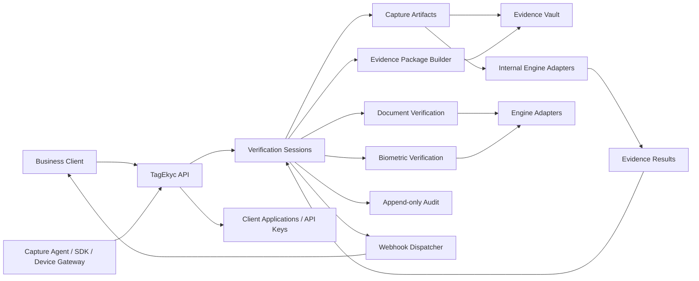

# TagEkyc High-Level Design v0.13

**Version:** 0.13
**Status:** Active — S1 baseline with TIP-88C1 v0.17 planning amendment
**Date:** 2026-07-29

## Changelog

### v0.13 — TIP-88C1 v0.17 final projection-clock correction

- Separated configuration readiness, CaptureAgent pre-wait and custody
  post-wait projections; the server never re-adds an elapsed wait.
- Re-derived late token/backoff expired-owner paths sequentially after the
  shared lease/minimum-age owner-CAS anchor.
- Removed the duplicate per-claim attempt limit and transferred retry-count
  accounting to the mandatory Build-Brief gate.

### v0.12 — TIP-88C1 v0.16 self-auditing planning closure

- Synchronized the 15-path continuation/readiness derivation and the
  pending/ready same-owner and expired-owner state split.
- Synchronized the complete normative-symbol/register audit, five finite
  attempt/key/object/retry limits, common busy backoff and durable disposition
  clock.
- Recognized exact-fence `Terminated` and P4 `TerminatedBeforeStart` as the two
  prior-R2 settling values. Planning remains blocked for independent review.

### v0.11 — TIP-88C1 v0.15 symbol and retry correction

- Deferred every phase/residue/retry/body/admission statement in the C1
  subsection to Planning section 10.0 and registered exact symbol ownership in
  Planning section 15.1.
- Added the expired-owner reclaim term to the three-case continuation
  projection.
- Made temporary unavailability retryable but non-terminal/non-replay-stable
  and replaced client-observation language with server-observable P4/P5 facts.

### v0.10 — TIP-88C1 v0.14 phase-table and termination-budget correction

- Made Planning section 10.0 the single P0–P7 transport source and separated
  metadata-only finalization from body-required progression.
- Added exact P4 post-R1/pre-admission terminalization while preserving Bound
  alias/idempotency evidence.
- Added four bounded no-default prior-R2 termination budgets and conditional
  remaining-lifetime projections.

### v0.9 — TIP-88C1 v0.13 admission and re-entry correction

- Added a metadata-first admission signal inside the one external operation,
  forbade proxy/disk prebuffering and recorded the bounded memory-only
  kernel/TLS residual.
- Split internal claim progression from the CaptureAgent final result union.
- Added fenced same-owner re-entry only after durable prior-R2 termination.
- Removed dynamic agent-capacity attestation; local exhaustion stays local and
  server capacity outcomes are custody-only.

### v0.8 — TIP-88C1 v0.12 physical-capacity correction

- Split CaptureAgent retained-buffer capacity from custody-server plaintext
  stream-window capacity; removed the aggregate-subsuming worst-case product
  relation and required independently reachable slot/aggregate reservations.
- Classified aborted/cancelled/incomplete bodies as retryable
  `RAW_EXPORT_SOURCE_TEMPORARILY_UNAVAILABLE`, distinct from terminal clean-EOF
  `CONTENT_COMMITMENT_MISMATCH`.
- Synchronized the exact two positive commitment vectors, unsupported
  `LivenessMedia` negative, and phase-specific declaration correction.

### v0.7 — TIP-88C1 v0.11 transport and bounded-capacity correction

- Pinned one external metadata-plus-bounded-stream operation shape per
  invocation;
  begin/broker/complete/R1–R6 remain internal and no upload-session, multipart,
  resume or public-completion surface exists.
- Added exact per-class size, per-operation/aggregate plaintext-memory and
  per-producer/deployment concurrency configuration, failure codes and
  admission/cleanup boundaries.
- Added the token TTL to the one-lost-response retention relation and separated
  live-evaluation wait from lookup-lock contention with an exact retry boundary.
- Ratified D2 for DG2 portrait and live selfie only; deferred LivenessMedia to a
  separately ratified resumable transport slice.

### v0.6 — TIP-88C1 v0.10 lifecycle and privacy correction

- Removed the claimed digest from producer-envelope v2; keyed commitment is the
  only persisted content verifier and R3 remains the authoritative byte check.
- Separated stable alias identity from a CAS-replaceable current evaluation
  issuance and pinned response-loss/concurrent-begin/reissue/cleanup behavior.
- Made R1 admission use the effective server-capped plaintext deadline, froze
  all token/continuation budget bounds, closed the response union and
  length-prefixed every C1-only `C1HashCanonical` scalar without changing the
  landed Evidence-Integrity `HashCanonical` JCS codec.
- This remains review-required planning only and authorizes no implementation
  or real raw persistence.

### v0.5 — TIP-88C1 v0.9 external-review correction

- Bound begin-issued claim tokens to a server-canonical producer-claim envelope
  fingerprint and required broker-owned completion to persist only a
  recomputed, normalized admission.
- Made evaluation expiry identical to token expiry, qualified retries by the
  complete token lineage, split capability residue by phase, and selected
  active/historic failure types by token variant.
- Corrected reconciliation from “no plaintext” to bounded producer-buffer-
  independent plaintext verification and added custody-worker lifetime,
  zeroization and host-posture gates.
- This remains a review-required planning amendment and authorizes no
  implementation or real raw persistence.

### v0.4 — TIP-88C1 v0.8 capture-time custody synchronization

- Separated capture-time retained-source establishment from later B3/B4 export,
  and added executable ingress idempotency, fenced recovery, keyed commitments,
  immutable authority snapshots, and accepted-session source selection.
- Added complete R1 cryptographic recovery context, CaptureAgent-owned effective
  plaintext lifetime, graceful/abrupt-loss semantics, historic-key/DR posture,
  and Available-only resolver visibility.
- Added pre-Prepare plus in-Seal authority checks, exact C2 preparation
  disposition arbitration, monotonic renewal, and production host-readiness
  boundaries without authorizing implementation or real raw persistence.
- Closed v0.8 V1 review gaps with begin/complete rotation-safe claim, an
  instance-independent exact-artifact edge, source/attempt/staged fingerprints,
  idempotent R1 key reference, executable complete-provisional recovery,
  server-authored acceptance events/session selection, deterministic C2
  pre-registration, and a complete least-privilege capability graph.
- Closed the V3 claim/R1 split by making the NewCandidate `complete` branch the
  atomic R1 transaction; no source is returned before complete recovery context
  commits.
- Closed V4 follow-on gaps with distinct single-use New versus idempotent
  Existing comparison tokens, fresh in-`complete` authority revalidation, and
  monotonic non-reused evaluation identity/revision/fence.
- Applied the v0.8-V5 checkpoint corrections: durable claim-key aliases/
  tombstones, a stateful opaque token broker, typed dependency results routed
  through `complete`, and closed token outcomes.
- Applied the final v0.8-V6 planning corrections for broker-owned completion,
  mandatory bounded token TTL, exact alias/canonical residue, and the complete
  token-variant/result matrix. These patches require external review and do not
  authorize implementation.

### v0.3 — TIP-88C1 retained-custody candidate synchronization

- Recorded the Homeowner-ratified `EncryptedRawVaultRetained` direction without
  closing its controller/legal/retention/purge/hold/access decisions or
  authorizing raw persistence/reuse.
- Added C1-owned immutable per-job source binding, distinct reservation/staged
  ciphertext identities, committed-seal/finalize-wins recovery, and the
  required B4 `AssemblySealed` non-reclaimability amendment.
- Restored the public-API versus custody process/credential boundary and the
  canonical prohibited-observability/non-claims posture.
- Preserved separate artifact persistence, resolver/readability, and C2
  package-completeness gates.

### v0.2 — TIP-88C1 secure raw-source planning amendment

- Recorded the planned C1 ownership boundary for encrypted raw-source custody,
  provider-neutral storage, bounded resolution, authenticated sealed assembly,
  and the metadata-only B4/C2 handoff.
- Preserved raw-payload default deny and the exact `GOV-001`/`ART-001` through
  `ART-009` fixture, real-artifact, and production gates.
- Recorded S3-compatible/pinned-MinIO as reference integration evidence only;
  no provider, raw-data, implementation, or production authority is granted.

### v0.1 — Initial high-level design

- Established the S1 product, architecture, security, evidence, and consumer
  boundaries.

## Product Purpose

TagEkyc is an independent eKYC and identity assurance platform. It verifies identity evidence from documents, CCCD/NFC, face match, liveness, fingerprint, and risk signals, then produces auditable evidence packages for external systems.

TagEkyc MUST answer who the person is. It MUST NOT answer what document the person agreed to sign.

## Non-Goals

- TagEkyc MUST NOT perform document signing, transaction-consent signing, qualified digital signing, or non-repudiation signing for SignFlow. TagEkyc MAY sign its own eKYC proof/evidence envelope for integrity, origin identification, and audit verification.
- TagEkyc MUST NOT render signing documents for consent.
- TagEkyc MUST NOT depend on SignFlow internals.
- TagEkyc MUST NOT expose raw sensitive evidence to consumers by default.
- S1 MUST NOT claim production legal certification, regulatory approval, or production biometric assurance.

## Target Consumers

- SignFlow
- Hospital Information Systems
- Patient Portal applications
- Registration and onboarding portals
- Internal operator tools
- Other client applications requiring identity assurance

TagEkyc also distinguishes caller roles. Business clients create sessions and consume sanitized results. Capture agents, SDKs, and device gateways submit captured artifacts under separate scopes. Internal adapters process artifacts into evidence results inside secure boundaries. Operator/admin tools are privileged operational callers.

## High-Level Architecture


```mermaid
flowchart LR
    Client["Business Client"] --> Api["TagEkyc API"]
    Agent["Capture Agent / SDK / Device Gateway"] --> Api
    Api --> Sessions["Verification Sessions"]
    Api --> Auth["Client Applications / API Keys"]
    Sessions --> Artifacts["Capture Artifacts"]
    Artifacts --> Vault["Evidence Vault"]
    Artifacts --> Adapters["Internal Engine Adapters"]
    Adapters --> Results["Evidence Results"]
    Results --> Sessions
    Sessions --> Doc["Document Verification"]
    Sessions --> Bio["Biometric Verification"]
    Doc --> Engines["Engine Adapters"]
    Bio --> Engines
    Sessions --> Evidence["Evidence Package Builder"]
    Evidence --> Vault
    Sessions --> Audit["Append-only Audit"]
    Sessions --> Webhooks["Webhook Dispatcher"]
    Webhooks --> Client
```

## Suggested Bounded Contexts / Modules

### Tenancy / Client Applications

Manages external client applications, API keys, permissions, webhook subscriptions, allowed purposes, and callback configuration. It SHOULD isolate sessions by client application.

### Verification Sessions

Owns lifecycle, state transitions, RequiredChecks policy, profile, external correlation fields, captured artifacts, verification checks, evidence results, evidence package, callbacks/webhooks, expiry, and final decision assembly. `VerificationSession` is the root business correlation object, not merely a technical session id. It MUST use explicit state and result enums.

`STANDARD_EKYC_PROFILE` is the generic platform profile for ordinary identity assurance. `CHALLENGE_BOUND_EKYC_PROFILE` is used when the result must carry an opaque caller-owned challenge for the consuming client's own binding workflow. TagEkyc stores and echoes the challenge but MUST NOT interpret it as a transaction id, document id, consent proof, or nonce hash. Legacy `TRANSACTION_BOUND_EKYC_PROFILE` and `bindingNonceHash` inputs are compatibility aliases only.

### Capture Artifacts

Represents captured, uploaded, or received inputs such as document images, selfie images, liveness media, NFC read artifacts, fingerprint captures, and device/capture metadata. Raw artifacts MUST remain inside vault or secure adapter boundaries.

### Evidence Results

Represents processed outputs derived from one or more capture artifacts, such as OCR, NFC validation, face match, liveness, fingerprint match, fraud/risk, and capture quality results. Business clients receive sanitized result summaries, refs, hashes, and correlation fields.

### Document Verification

Owns OCR document evidence, CCCD/NFC result shapes, document consistency checks, and document-level confidence signals.

### Biometric Verification

Owns face match, liveness, fingerprint, and biometric confidence/risk signals.

### Evidence

Builds `EkycEvidencePackage` from immutable evidence result records, artifact refs, VaultRefs, hashes, timestamps, adapter versions, and audit references.

### Vault

Stores sensitive artifacts or references to external secure storage. Business consumers receive sanitized result summaries, evidence refs, package refs, hashes, and correlation fields instead of raw sensitive data. Internal VaultRefs MAY be exposed only through explicit evidence-access policy, authorization, and audit. Default business-consumer payloads MUST NOT expose raw artifacts.

### Audit

Records append-only events for session creation, evidence ingestion, adapter execution, result calculation, webhook delivery, and administrative actions.

### Webhooks

Dispatches verification completion callbacks to subscribed consumers with retry tracking and signature metadata. Production design SHOULD distinguish `payloadSignature`, `webhookSignature`, and `evidencePackageSignature`; S1 MAY use placeholders.

### Device/Agent Gateway

Coordinates browser/mobile/agent capture flows when device-side evidence is required. S1 MAY use simplified PoC ingestion endpoints.

### Engine Adapters

Defines interfaces for OCR, NFC, face match, liveness, fingerprint match, risk evaluation, evidence vault, and webhook delivery. S1 MAY use mock adapters behind these interfaces.

## S1 Boundary

S1 MUST include:

- Verification Session API
- Client Application/API Key authentication model
- RequiredChecks policy
- `STANDARD_EKYC_PROFILE` and `CHALLENGE_BOUND_EKYC_PROFILE` policy naming, with legacy transaction-bound aliases accepted only for compatibility
- CaptureArtifact and EvidenceResult logical model
- Generic `CAPTURE_QUALITY` result category
- CCCD/NFC result shape
- Face match result shape
- Liveness result shape
- Fingerprint result shape
- Evidence VaultRef model
- `EkycEvidencePackage`
- Append-only audit log
- Webhook/callback result delivery
- SignFlow integration contract

S1 MAY include optional PoC adapters for OCR CCCD, NFC document reading, face matching, liveness detection, fingerprint matching, and risk evaluation. These MUST remain behind interfaces.

## Future Production Boundary

Production readiness SHOULD add:

- Certified document/NFC readers where legally required
- Certified biometric/liveness engines where legally required
- Hardware-backed key management for evidence signing
- Stronger vault encryption and retention controls
- Regulatory audit evidence, operator review, and compliance workflows
- Formal threat model and privacy impact assessment
- Operational monitoring, alerting, and incident response

## Security / Privacy Principles

- Raw CCCD, face, liveness, and fingerprint artifacts MUST be treated as highly sensitive.
- Consumer result payloads MUST use sanitized result summaries, evidence refs, package refs, hashes, and correlation fields.
- API keys MUST be hashed at rest and scoped by client application.
- Webhook payloads SHOULD be signed when the signature model is implemented.
- Business clients MUST NOT be treated as automatically trusted to submit arbitrary `PASSED` evidence.
- Capture/adapter submission scopes MUST be distinct from ordinary business client scopes.
- Evidence access MUST be audited.
- Data retention MUST be explicit per client and purpose.
- S1 SHOULD minimize raw artifact persistence unless needed for evidence replay.

## Evidence Principles

- Evidence records MUST be append-only once accepted.
- Evidence packages MUST include deterministic manifests.
- Hashes MUST be computed over canonical evidence metadata and referenced artifacts.
- Evidence packages SHOULD include adapter name/version and confidence values.
- Result decisions MUST be reproducible from the evidence manifest where possible.

## Provider-Neutral Artifact Evidence Lifecycle

The artifact evidence lifecycle is a provider-neutral planning/design requirement. It governs how HLD/LLD docs describe durable metadata, references, artifact/raw evidence boundaries, package candidates, lifecycle states, and later review packets. It does not implement runtime behavior, approve packets, select providers/storage/resolvers/tools, authorize artifact/raw evidence persistence, authorize raw payload handling, authorize restricted artifact access, or claim readiness.

Durable metadata may carry classified metadata-safe references, hashes, identifiers, and sanitized summaries. Durable metadata is not artifact/raw evidence storage, and metadata references are not evidence availability proof. Any later reliance on a reference requires a reviewed reference resolution packet.

Artifact/raw evidence storage remains authorization-gated. Candidate artifact object classes, package manifest positions, and package completeness candidates are planning/design concepts only. They are not complete packages, artifact availability proof, storage capability, or persistence authorization.

Raw payload collection and persistence are denied by default. Provider-specific evidence collection remains blocked until a later reviewed provider evidence authorization packet explicitly permits a narrow classified scope. `ART-009` must be treated as a hard blocker before provider-specific evidence collection.

The high-level lifecycle dependency ordering must be carried as:

1. `GOV-001` branch/deferred-scope traceability must be carried forward until resolved by a later reviewed TIP.
2. `ART-009` raw payload default-deny posture before provider-specific evidence collection.
3. `ART-001` storage boundary before artifact/raw evidence persistence.
4. `ART-002` reference resolution before evidence availability reliance.
5. `ART-008` orphan handling before orphan-risk references support evidence or package positions.
6. `ART-004` retention/expiry before retained, unexpired, or reviewable reliance.
7. `ART-005` purge/disposal before disposal, tombstone, quarantine, or reference/package impact reliance.
8. `ART-006` legal-hold sync before hold state becomes authoritative for retention, expiry, disposal, reference, package, or evidence decisions.
9. `ART-007` access/audit/security before access, audit, restricted evidence, or security reliance.
10. `ART-003` package completeness after required object classes and dependency gates are carried or resolved for the reviewed package use.

STOP/RRI is required before runtime implementation, provider-specific evidence collection, provider/storage/resolver/tool/schema/API/package selection, raw payload collection or persistence, artifact/raw evidence persistence, restricted artifact access, packet approval, reference-as-proof use, package-complete claims, or any claim that `GOV-001` or `ART-001` through `ART-009` are resolved beyond planning/design requirements. STOP/RRI is also required before HLD/LLD documentation is treated as legal, audit, security, production, pilot, certification, readiness, support, evidence availability, package completeness, or capability proof.

### TIP-88C1 planned secure raw-source and sealed-assembly boundary

TIP-88C1 is the planned first real raw-artifact custody slice. Its canonical
lifecycle is:

```text
capture
→ capture-time R1–R6 retained encrypted-source establishment
→ Available source
→ later B3 authorization and B4 job
→ exact accepted-session source freeze/read
→ authenticated bounded assembly
→ C2 protected preparation
→ sealed-assembly evidence
```

Ingress contains no `JobId`. Every phase/residue/retry/body/admission statement
in this C1 subsection is a non-normative projection of TIP-88C1 Planning
section 10.0; if wording differs, section 10.0 wins. Each CaptureAgent invocation
uses one external authenticated custody-ingress operation shape for one artifact;
a retry invokes the same shape again with the same UUID, with no external
begin/upload-part/complete sub-protocol.
After metadata and internal claim comparison, metadata-only outcomes—including
AlreadyAvailable, live evaluation, conflict, busy and authority failures—return
one `CaptureAgentFinalResult` without `AdmissionAccepted`, body or a new
R1/attempt/key/object. Only a committed new R1 or eligible same-owner/reclaim
CAS emits `AdmissionAccepted`; the agent then transmits one bounded body and
receives one final result. CaptureAgent supplies one stable
v4 UUID claim key, accepted capture id/revision and authenticated
producer/session/class identity. `begin`, broker comparison, broker-only
`complete`, R1–R6, `InternalClaimResult` and all claim tokens are internal to
TagEkyc. C1 exposes no
upload session, part/receipt, resume, public completion or agent-held
provider/storage capability. CaptureAgent/proxy/middleware must not transmit,
read, prebuffer or spill the body before admission; exact early-body failure is
`RAW_EXPORT_SOURCE_TRANSPORT_PROTOCOL_INVALID`. Kernel socket/TLS buffers may
hold only the pinned bounded memory-only residual and never disk spill.
Qualified realizations may use `Expect: 100-continue` or duplex metadata/server
admission framing without selecting a framework. R2 reads the admitted stream
once. Planning section 10.0 separately owns P0–P3 zero-committed-R1 rejection
and P4 post-R1 `AdmissionProtocolRejected` / `TerminatedBeforeStart` cleanup;
P4 retains Bound alias/canonical anti-reuse evidence.
The server classifies P4 only before successful `AdmissionAccepted` write/flush
with body reader/provider writer unarmed; successful write/flush or reader
arming is P5. No client-observation acknowledgement is assumed.
A bounded begin/broker-complete claim freezes the active or historic HMAC-key
selector in durable internal state; the selector is never returned to ingress.
Every observed client/producer/instance/UUID lookup key first owns one durable
alias row. The instance-independent exact-artifact row remains the one canonical
source claim. An exact replay under a new key binds that alias to the canonical
claim before returning internal `ExistingMatch`; a conflict burns it as
`ConflictTombstone`, so A(K1) → A(K2) can never let B(K2) create another source.
`begin` New persists one Evaluating alias plus a bounded non-source
`ClaimEvaluating` canonical shell; Existing-alternate persists one Evaluating
alias and leaves the canonical claim unchanged. A pre-begin failure persists
neither.
A NewCandidate receives a single-use, shell-backed token; an ExistingCandidate
receives a bounded idempotently replayable comparison token. Both are 32-byte
CSPRNG opaque capabilities whose digest, schema, variant, audience, expiry,
alias identity and immutable content-free v2
`ProducerClaimEnvelopeFingerprint` are durable. The alias owns one
CAS-replaceable current evaluation slot with a fresh non-reused evaluation id,
owner, token digest/times and strictly increasing revision/fence per issuance,
plus a monotonic latest-issued expiry. Evaluation issue/expiry equals token
issue/expiry exactly; there is no second evaluation lease. A live unexpired
slot is never overwritten: concurrent/repeated begin after an internally lost
begin result returns
`RAW_EXPORT_SOURCE_CLAIM_EVALUATION_IN_PROGRESS` with exact
`RetryNotBeforeUtc = CurrentTokenExpiresAtUtc`, distinct from lookup-lock
`RAW_EXPORT_SOURCE_IDEMPOTENCY_BUSY`. After expiry/terminal/reclaim eligibility,
or on a Bound alias after expiry, a fresh slot may be issued. Old tokens restart;
unbound cleanup waits beyond the latest-issued expiry plus a bounded margin.
The bearer carries opaque token bytes plus non-secret evaluation id/revision/
fence/variant/expiry restart metadata, so a stale lineage is RestartRequired
while a digest mismatch on the current lineage remains TokenInvalid.
One lost-result cycle is admitted only when its exact Planning `RP-*` path
includes token TTL plus lock, claim comparison, complete, the selected
pending/ready termination and reclaim terms, replacement R2 and safety, and
fits strictly inside both continuation and maximum producer-retention bounds.
CaptureAgent waits to the returned retry boundary only while that path still
holds; otherwise it zeroizes and requires recapture.

The ingress orchestrator can call only `begin`; it has no token-validator,
`complete` or commitment-key-registry access. An isolated claim-comparison
broker validates the opaque token against the durable alias, internally derives
exactly one typed `DerivedAdmission` containing the recomputed producer-envelope
fingerprint, keyed-commitment tuple and normalized length/media/capture/
retention claims, or an active-key-unavailable, historic-key-unavailable or
token-invalid result, and calls `complete` itself in the same invocation.
It never supplies a trusted final `AdmissionFingerprint`; `complete` verifies
the immutable envelope binding and recomputes that fingerprint from persisted
identity plus normalized claims. The typed result never crosses to ingress.
Every valid begun claim
re-enters broker-owned `complete`; no external dependency returns the final
outcome.

For NewCandidate, broker-owned `complete` is the one short R1 transaction: after exact token/
alias/row validation it freshly revalidates current actor/client/session/
accepted-capture/retention authority, then interprets the typed broker result
and CAS-maps both lookup edges while allocating
the server source and persisting its complete attempt/fence/key-reference/
object/recovery context. ExistingCandidate performs the same fresh authority
barrier before any source disclosure or comparison, then binds the alias while
leaving the canonical reservation read-only. Only the committed
NewCandidate transaction returns internal `NewReservation`. Rotation, authority change,
concurrent winner/rollback, stale-token reclaim, crash before/after commit, and
CaptureAgent restart cannot duplicate the source, advertise a context-free
source, or disclose it on conflict/busy. Identity is distinct from
producer-claimed digest/length/media/time. Envelope v2 freezes identity,
length, media, capture and retention values but contains no digest or other
content-derived value. The isolated custody boundary persists only a dedicated
versioned HMAC content commitment, never a bare Raw BIO digest. The keyed
commitment owns claimed-digest binding and R3 verifies actual streamed bytes.
A digest-only change after begin therefore conflicts at Existing comparison or
burns one fenced New attempt and fails at R3; it never publishes. New-token
v2-envelope or lineage mismatch is token invalid;
business fingerprint conflict exists only when an Existing token is correctly
bound but differs from the persisted canonical admission.

The NewCandidate `complete`/R1 transaction commits every recoverable
cryptographic input—attempt revision/fence,
provisional object identity, suite/framing/nonce context, an idempotent
`AttemptKeyReservationId`, immutable authority snapshot and keyed
commitment—before provider/key/object I/O. R2 create-or-gets that exact attempt
key and performs one bounded AEAD stream. A self-authenticating completion
record plus exact-attempt provisional inspect/read lets a fenced reconciler
bounded-decrypt complete ciphertext, recompute length/commitment, and CAS R3
without restarting R2 or relying on process-memory results. Source-stable,
attempt and staged fingerprints are distinct. A reconciler cannot reconstruct
the lost CaptureAgent buffer or compete with a healthy producer. CaptureAgent owns its
monotonic plaintext deadline; the server only shortens it. Before R1,
`complete` computes the minimum of producer expiry and the mandatory bounded
server continuation cap and requires that effective remainder to be strictly
greater than encryption-attempt deadline plus safety margin. Producer-valid but
server-cap-insufficient input creates no R1/source/key/object. Graceful terminals
execute verified zeroization. Abrupt process/host loss makes no active-erasure
claim and requires recapture unless remaining work is independent of the
producer-held buffer; bounded reconciliation decrypt still follows custody
plaintext hygiene: at most one configured plaintext chunk and one unwrapped
attempt key are live, both are zeroized/disposed on every graceful exit, and a
separate custody-reconciliation host-posture readiness gate fails closed as
`RAW_EXPORT_CUSTODY_RECONCILIATION_HOST_POSTURE_INVALID`.

After a dead external call, the same authenticated client/producer/instance/
UUID/session/artifact owner may re-enter without waiting for lease expiry only
when a server CAS matches the exact current reservation revision/fence and
durable `PreviousFencedR2Terminated` proves the request reader and provider
writer are quiesced, the exact attempt is terminal, and the old fence recorded
`Terminated` or, for P4 with neither reader nor writer armed,
`TerminatedBeforeStart`. Before that proof the owner is
`SameOwnerRetryPendingTermination` and cannot start a replacement; afterward it
is `SameOwnerReentryReady`. The owner marker remains; the new attempt
revision/fence is monotonic and internal. Expired-owner reclaim has the same
pending/ready split and adds reclaim cost in both cases. Different producer,
stale CAS or not-yet-settled writer remains bounded
`RAW_EXPORT_SOURCE_RESERVATION_BUSY` or becomes `RECAPTURE_REQUIRED` when the
full path cannot fit.
The prior reader, writer, provider abort/inspection and termination-CAS steps
have four mandatory bounded no-default budgets. Their checked sum is
`PreviousR2TerminationBudget`: readiness includes the worst case, while runtime
counts it only until `PreviousFencedR2Terminated` is durable and never counts it
again afterward.

The D2 ingress subset is exactly `ChipDg2Portrait` and `LiveSelfieImage`.
`LivenessMedia` and every other class fail closed before source read.
LivenessMedia requires a separately ratified upload-session/part/receipt/
resume/expiry/backpressure/completion-manifest transport; AEAD `ChunkSize` is
not a transport part. Mandatory no-default configuration is split by physical
host: CaptureAgent locally owns exact class-size, retained-buffer-slot and
aggregate producer-plaintext admission and never calls the server when local
capacity fails; custody directly owns per-stream
plaintext-window, per-producer/deployment stream-slot and aggregate-window
admission. The server may refuse an oversized declaration but receives no
agent reservation assertion/attestation and never claims to enforce
CaptureAgent process memory. There is no worst-case product-cover relation: slot and aggregate
branches must each bind independently in a supported fixture. Declared oversize
and unavailable capacity fail before begin/provider/key I/O as
`RAW_EXPORT_SOURCE_ARTIFACT_SIZE_LIMIT_EXCEEDED` or
`RAW_EXPORT_SOURCE_CAPACITY_UNAVAILABLE`. R2 independently counts actual bytes;
the first excess byte aborts the fenced attempt and can never publish.
Malformed or relationally invalid capacity configuration fails readiness as
`RAW_EXPORT_SOURCE_CAPACITY_CONFIGURATION_INVALID`.

A transport abort, cancellation or incomplete body maps to non-terminal,
non-replay-stable `RAW_EXPORT_SOURCE_TEMPORARILY_UNAVAILABLE` and performs
fenced R2 cleanup. The next same-UUID invocation returns reservation-busy while
termination is not durable, re-enters for the same owner when termination is
durable and the applicable 15-path projection fits, or requires recapture when
the budget is insufficient or the buffer is lost. A normally completed body whose clean-EOF
length/digest/commitment differs maps to terminal
`CONTENT_COMMITMENT_MISMATCH` and refuses same-UUID retry. Pre-begin zero-residue
declaration rejection may correct the declaration for the same unchanged
class-valid buffer; after R2 starts the declaration is frozen and correction
requires a new accepted capture/revision and UUID. Bytes above the class ceiling
cannot be admitted by changing the declaration.

Only `Available` descriptors can enter B4 source freeze. Landed
`capture_artifacts`/`QualityState` is not acceptance authority because it has no
capture revision or final selection. C1 therefore depends on additive
server-authored capture-acceptance events plus one immutable session-completion
selection per session/class. C1 freezes the exact
`CaptureAcceptanceId + CaptureArtifactId + CaptureRevision` referenced by that
selection into
`(JobId, Ordinal, RawClass, CaptureAcceptanceId, CaptureArtifactId,
CaptureRevision, SourceArtifactId)`. The acceptance surface/producer allowlist
requires separate ratification before Build Brief. First/latest/arbitrary
selection and recapture substitution remain forbidden. Separate jobs may bind
the same retained source only under fresh independent authority.

Each source carries an immutable versioned controller/purpose/retention/
revocation/purge/hold authority snapshot. Authority is refreshed at admission,
inside `complete` after external HMAC and before any disclosure/R1 allocation,
encryption, staging, publication, read/reuse, C2 Prepare, Seal and lifecycle
checkpoints. Loss before `Available` prevents publication; loss afterward
blocks read/reuse/delivery immediately. Physical purge versus hold remains
separately ratified.

C1 plans the metadata-only `Assembling → AssemblySealed` amendment. Landed B4
predates `AssemblySealed` lease finality and needs an additive early exclusion
making that state non-claimable/non-reclaimable/non-renewable. Before C2 Prepare
and inside Seal, authority is revalidated. Exact
`C2PreparationId` is deterministic and a `Preparing` disposition is durable
before C2 I/O; exact-id replay/lookup converts it to `Pending`. The same
`(AssemblyId,C2PreparationId)` disposition CAS occurs inside the seal
transaction with assembly identity/items, B4 head and transition, making
`SealCommitted` and `AbortAuthorized` mutually exclusive. Seal B cannot finalize
preparation A, no C2 object is unregistered, and a deadline alone cannot
authorize abort. Periodic renewal is joined before at most one monotonic final
renewal.

PostgreSQL may hold restricted metadata, including wrapped-key or recoverable
key references, but never raw/plaintext/ciphertext object bytes, unwrapped keys,
credentials or bare Raw BIO digests. Any storage locator stays inside the
restricted repository/adapter. The public API receives no provider, KEK,
commitment-key, subject-token-key, read, write, list, delete or admin authority.
Ingress owns begin/provisional write but no validator, `complete` or direct
commitment-key-registry edge. The isolated claim-comparison broker owns token
validation, active/historic derive and `complete` only through the durable
alias-bound token and accepts no caller-selected selector; it cannot enumerate
or export keys. Fenced reconciliation owns
exact-provisional inspect/read plus historic verify/unwrap; assembly owns
committed-`Available` read plus historic verify/unwrap; lifecycle owns exact
delete/hold without read/HMAC/unwrap. Distinct identities/process scopes enforce
the graph. Missing/extra edges, alias/function ACL drift, token CSPRNG/digest/
audience/TTL drift, direct ingress validator/complete/key access, missing
`RawExportSourceClaimEvaluationTokenTtlSeconds`, a non-integer or value outside
1–300 seconds, a missing/out-of-range claim budget/tombstone margin/server-
continuation cap, or an invalid timeout/effective-deadline relation fails
readiness. Every component has an exact mandatory no-default owner/unit/range;
latest-issuance cleanup is bounded to token TTL plus at most 300 seconds. The DB
issues token time from UTC-microsecond `statement_timestamp()`; expiry cannot
diverge from evaluation expiry, and cleanup waits beyond the maximum token/
evaluation horizon plus safety margin. Active/historic unavailable result type
is selected by token variant, so Existing remains Historic even when its stored
key version equals the current active version. Token tamper/
binding failures map exactly to `RAW_EXPORT_SOURCE_CLAIM_TOKEN_INVALID`;
expiry/stale/reclaim maps to `RAW_EXPORT_SOURCE_CLAIM_RESTART_REQUIRED`.
The readiness duration relation is derived from Planning section 15.1
`RP-01`–`RP-15`: five mutually exclusive state cases crossed with no wait, one
live-evaluation wait or one exact common busy backoff. Every path is strictly
below both the continuation window and maximum producer plaintext retention;
the combined evaluation-wait + prior-termination + expired-owner-reclaim path
cannot be omitted. Lease and reconciler minimum age share the exact owner-CAS
reservation/attempt anchor and may use `max`; a later token or busy backoff has
a different anchor and is added sequentially. Readiness includes one future
worst-case wait, CaptureAgent includes the future wait before sleeping, and the
custody server uses DB time after waiting and includes only future operation
cost. Whether the caller waited is irrelevant to that server formula; no
elapsed wait is recharged. The register owns three independently binding
source/key/object limits and the non-resettable disposition start/expiry.
Retry-count accounting is unpinned and blocks Build-Brief dispatch at
`C1-BB-RETRY-COUNT-ACCOUNTING-GATE`; no durable cross-process enforcement is
claimed. The exact eight-key
physical-host capacity manifest has checked bounds and host-local relations;
aggregate exhaustion remains reachable because readiness does not require
either aggregate to cover maximum reservation multiplied by maximum
concurrency.

Planning D4.3 owns two distinct closed unions. `InternalClaimResult` carries
NewReservation/ExistingMatch/ReservationReclaimed and internal claim outcomes
only inside custody ingress. `CaptureAgentFinalResult` alone can egress:
Available/AlreadyAvailable, ClaimEvaluationInProgress with exact
`RetryNotBeforeUtc`, or one enumerated OutcomeOnly code. No internal
claim/owner/revision/fence field or assembly outcome can cross that boundary.
Their phase membership, body/admission rule, residue and retry are not restated
here; Planning section 10.0 owns them.

Ingress readiness separately pins
`RawExportIngressMaximumPreAdmissionBufferedBytes` and fails as
`RAW_EXPORT_INGRESS_TRANSPORT_POSTURE_INVALID` when any proxy/middleware hop
cannot prove the admission phase, disabled request/disk buffering and the
bounded memory-only residual.
Every `C1HashCanonical` codec hashes an LP-framed domain followed by each
independently LP-framed canonical scalar; ordered arrays include an LP count and
LP fields in declared order. This C1-only codec does not change the landed
Evidence-Integrity `HashCanonical` JCS contract.

The first reference adapter is S3-compatible and may be exercised only against
an exact pinned MinIO version/digest under a reviewed generated,
non-patient-fixture authorization. MinIO is neither a domain dependency nor a
production-approved provider. An encrypted-filesystem adapter remains an
optional, separately qualified single-node alternative.

Before reference-provider fixture evidence, the reviewed authorization must
carry `GOV-001` and every `ART-001` through `ART-009` row and satisfy the
applicable storage, resolution, orphan, retention/expiry, purge/cleanup,
hold-conflict, access/audit/security, and raw-payload fields from TIP-38 through
TIP-46. Fixture-only dispositions do not close corresponding real-artifact
gates and cannot prove real-artifact, production, legal/compliance, audit,
security, readiness, performance, retention-policy, production-provider
qualification, evidence availability, or package completeness.

Before any real capture artifact is persisted, reviewed evidence must resolve
`ART-001`, `ART-004`, `ART-005`, `ART-006`, `ART-007`, `ART-008`, and
`ART-009` for the chosen topology. `ART-002` must close before source
availability is relied upon, and `ART-003` remains C2 package-completeness
scope. Capture-time retention authority is distinct from later B2 export
consent; B2 cannot retroactively authorize an earlier raw retention.

This v0.10 amendment has status
`PLANNING PATCHED — INDEPENDENT REVIEW REQUIRED — IMPLEMENTATION BLOCKED`.
It is planning synchronization only and authorizes no source,
test, schema, migration, package, provider evidence collection, raw payload
handling, implementation, commit, push, deployment, or production activation.

## SignFlow Integration Overview

SignFlow is the first named `CHALLENGE_BOUND_EKYC_PROFILE` consumer, not the generic TagEkyc platform model. Generic sessions do not default to `externalSystem = SignFlow` or `purpose = SIGNING_AUTH`.

For signing authorization, SignFlow creates a TagEkyc verification session with `externalSessionId`, optional `clientReference`, `subjectRef`, `purpose = SIGNING_AUTH`, opaque `challenge`, and `requiredChecks`. Any `externalSystem` or `clientCode` value MUST be derived from or validated against the authenticated `clientApplicationId`. Legacy `externalTransactionId` and `bindingNonceHash` request keys may be accepted only as input aliases for `ClientReference` and `Challenge`.

TagEkyc returns a verification result, evidence package identifiers/hashes, and the verification view when enabled. SignFlow MUST validate that `externalSessionId`, `clientReference`, `challenge`, final result, evidence hashes, and proof authenticity match its own signing transaction before binding the evidence to a signing session.
