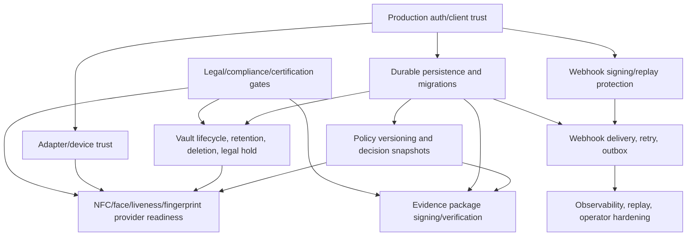

# TIP-10 Production Readiness Planning Compass v0.1

**File:** `docs/tips/tip_10_production_readiness_planning_compass/tip_10_planning_brief_v0_1.md`
**Version:** 0.2
**Status:** Accepted - planning only
**Date:** 2026-06-12
**Baseline:** `4f780cc8fa519d5c3febfeb94e9563a658a29749`
**Purpose:** Ranks post-S1 deferred production-readiness work, maps dependencies, and recommends the safest first runtime TIP after S1 without dispatching implementation.

## Changelog

### v0.2 - Planning accepted

- Recorded GPT Gate acceptance with no blocker findings.
- Accepted `TIP-11 - Production Data Boundary and Durable State Foundation` as the safest first runtime TIP after S1.
- Reconfirmed that TIP-10 does not dispatch TIP-11 implementation or open DB/migrations, webhook/outbox/retry, crypto, vendor selection, raw artifact storage, pilot readiness, production readiness, or SignFlow runtime dependency work.

### v0.1 - Initial planning compass

- Opened TIP-10 as a docs-only post-S1 planning artifact.
- Inventoried S1 deferred production blockers and residual debts from Product Brief, HLD, LLD, debt registry, TIP-07, TIP-08, and TIP-09 closeout state.
- Ranked deferred work as P0, P1, or P2 using pilot, production reliance, and operational-hardening impact.
- Added dependency ordering rationale and candidate next runtime TIPs.
- Recommended the safest first runtime TIP after TIP-10 while preserving all non-production, non-certified, and SignFlow external-consumer boundaries.

## 1. TIP-10 Planning Summary

TIP-10 is planning only. It does not reopen S1 implementation and does not authorize a runtime dispatch.

S1 is closed as:

```text
CLOSEABLE_LOCALDEV_EVIDENCE_READY_NON_PRODUCTION_NON_CERTIFIED
```

The post-S1 production-readiness path should start with prerequisite boundaries, not with the most visible deferred feature. Webhook delivery, retry, and outbox remain important, but they depend on durable persistence, production caller trust, policy/version identity, and webhook signing/replay design. They should not be the first runtime TIP unless the homeowner explicitly accepts a non-production-only delivery experiment.

TIP-10 recommendation:

```text
Recommended first runtime TIP after TIP-10:
TIP-11 - Production Data Boundary and Durable State Foundation
```

TIP-11 should be planned as a narrow foundation slice that establishes durable session/audit/evidence metadata boundaries, VaultRef-only raw-artifact separation, retention/legal-hold classifications, repository migration posture, and policy snapshot identity. It should not store raw biometric bytes, select vendors, implement production cryptography, dispatch webhooks, or claim pilot/production readiness.

## 2. Baseline Inputs Reviewed

- `docs/00_README.md`
- `docs/00_DOCS_GOVERNANCE.md`
- `docs/00_product_brief_v0_1.md`
- `docs/tag_ekyc_docs_baseline_closeout_v0_1_1.md`
- `docs/tagekyc_hld_v0_1.md`
- `docs/lld_01_data_model_v0_1.md`
- `docs/lld_03_api_contracts_v0_1.md`
- `docs/lld_04_engine_adapter_contracts_v0_1.md`
- `docs/phase1_scope_and_debt_registry_v0_1.md`
- `docs/signflow_integration_contract_v0_1.md`
- `docs/tips/tip_07_completion_notification/tip_07_planning_brief_v0_3.md`
- `docs/tips/tip_08_signflow_transaction_bound_profile/tip_08_planning_brief_v0_3.md`
- `docs/tips/tip_09_s1_hardening_closeout/tip_09_closeout_v0_1.md`
- `docs/00_AGENT_COORDINATION_BUS.md`

## 3. Deferred Scope Inventory

| Deferred item | Current S1 state | Why it matters after S1 |
| --- | --- | --- |
| Durable persistence, schema, migrations, backup, and recovery | In-memory LocalDev repositories only; no EF, DbContext, migrations, or production database. | Required before durable audit history, recoverable session state, reliable outbox, legal-hold workflows, or production operations can be trusted. |
| Raw biometric/artifact vault lifecycle, retention, deletion, and legal hold | Evidence package model uses VaultRef/hash concepts, but current runtime writes no raw vault objects and no retention enforcement. | Required before any real user artifact, biometric, NFC artifact, or sensitive device metadata is stored. |
| Production auth/client trust | LocalDev API-key model only. Caller categories and scopes exist conceptually and in S1 policy. | Required before real clients, capture agents, device gateways, trusted adapters, or operators can use the system outside LocalDev. |
| Adapter/device trust | CaptureAgent and TrustedAdapter boundaries exist, but no production onboarding, attestation, device identity, or vendor assurance. | Required before real devices or providers can submit capture artifacts or evidence results. |
| Webhook delivery, retry, outbox, and delivery ledger | TIP-07 implemented only an internal completion notification projection; no public webhook route, dispatcher, subscription, retry, or outbox. | Required before consumers rely on asynchronous completion delivery. Depends on durable state and signing/replay decisions. |
| Webhook signing and replay protection | Placeholder status only; no HMAC/JWS, timestamp tolerance, delivery id, replay cache, rotation, or secret lifecycle. | Required before production webhook reliance. |
| Evidence package signing and verification | Placeholder status only; deterministic package/manifest hashes exist but no managed signing keys. | Required before external audit reliance, legal non-repudiation claims, or long-term package integrity claims. |
| NFC provider readiness | S1 records document/NFC evidence shapes and mocks; no certified document/device compatibility or legal validation model. | Required before production identity decisions depend on NFC/document authenticity. |
| Face/liveness provider readiness | S1 has stable result shapes; no production PAD/liveness provider selection, bias testing, FAR/FRR acceptance, or threat model certification. | Required before production biometric assurance. |
| Fingerprint provider/default enablement | Fingerprint remains optional/demo/deferred and not a default SignFlow S1 check. | Required before fingerprint becomes mandatory or production-reliant. |
| Policy versioning and reproducible decision snapshots | RequiredChecks are persisted in S1 state; no durable versioned policy catalog or decision-policy snapshot identity. | Required before multi-client policies, audit replay, or legally explainable decision reproduction. |
| Request/correlation/idempotency conventions | Request/correlation fields exist in models; no production-wide conventions or log propagation contract. | Required before multi-client pilot support and incident investigation. |
| Specialized evidence endpoints | Deferred; S1 uses generic TrustedAdapter `/evidence-results`. | Useful only after adapter trust and provider boundaries are known. Not a first production-readiness blocker by itself. |
| Production payload signature model | Conceptual distinction exists; no canonical payload signing implementation. | Required only where signed request/response payload reliance is needed. |
| Legal/compliance/certification readiness | Explicitly not claimed in S1. | Required before any production-certified eKYC claim, real-user pilot policy approval, or regulated reliance. |
| Production adapter/device trust | No production trust program. | Required before real capture devices, SDKs, gateways, or provider adapters can submit authoritative evidence. |

## 4. P0/P1/P2 Classification

Classification guide used by TIP-10:

- P0: Blocks real-user pilot, legal/compliance approval, or safe handling of real sensitive evidence.
- P1: Blocks production reliance, external audit reliance, scale, or reliable consumer integration after P0 boundaries are in place.
- P2: Operational hardening, supportability, ergonomics, or later optimization.

| Priority | Item | Blocks real-user pilot? | Blocks production reliance? | Operational hardening? | Rationale |
| --- | --- | --- | --- | --- | --- |
| P0 | Raw artifact/biometric vault lifecycle, retention, deletion, and legal hold | Yes | Yes | No | Real user data cannot be collected safely without explicit storage boundary, retention, deletion, access, audit, and legal-hold posture. |
| P0 | Production auth/client trust foundation | Yes | Yes | No | Real clients, capture agents, trusted adapters, and operators need non-LocalDev identity, scopes, ownership, and credential lifecycle before they can submit or read evidence. |
| P0 | Adapter/device trust boundary | Yes | Yes | No | Business clients must not submit arbitrary `PASSED` evidence; real capture and evidence submission require scoped, auditable trusted actors. |
| P0 | Legal/compliance/certification readiness gates | Yes | Yes | No | Any pilot with real users or regulated reliance needs jurisdiction/use-case approval and clear non-certification boundaries. |
| P0 | Durable persistence boundary for session/audit/evidence metadata | Yes, when pilot records must survive or support data-subject/legal obligations | Yes | No | In-memory state cannot support recoverability, audit retention, legal hold, deletion workflows, or reliable evidence-package history. |
| P0 | Policy versioning and decision-policy snapshot identity | Yes, for policy-controlled real-user pilot | Yes | No | Required to explain which checks and thresholds governed each real-user decision. Should be introduced with durable state, not after. |
| P1 | Evidence package signing and verification | No, if pilot is explicitly non-reliance and non-certified | Yes | No | Needed before external audit reliance, long-term integrity claims, or legal non-repudiation. |
| P1 | NFC/document provider readiness | Potentially, if pilot decision relies on NFC | Yes | No | Production document assurance requires supported documents/devices and legal acceptance beyond S1 shape proof. |
| P1 | Face/liveness/PAD provider readiness | Potentially, if pilot decision relies on biometric assurance | Yes | No | Production biometric assurance needs provider evaluation, threat model, and performance acceptance. |
| P1 | Fingerprint provider readiness/default enablement | Only if fingerprint is part of the pilot policy | Yes, if fingerprint is mandatory | No | Fingerprint remains optional/demo/deferred and should not become default without device trust and privacy controls. |
| P1 | Webhook signing/replay protection | No, if polling/manual retrieval is accepted for pilot | Yes | No | Required before production webhook reliance or consumer systems bind results from asynchronous callbacks. |
| P1 | Webhook delivery, retry, outbox, and delivery ledger | No, unless pilot requires async integration | Yes | Partly | Requires durable state, idempotency, signing/replay, subscription trust, and observability assumptions. |
| P1 | Request/correlation/idempotency conventions | Helpful for pilot | Yes | Yes | Needed for multi-client support, support lookup, duplicate suppression, and incident response. |
| P1 | Production payload signature model | No, unless signed API payloads are required by policy | Yes, in signed-payload environments | No | Separate from webhook and evidence package signatures; should follow auth/trust and canonical payload decisions. |
| P2 | Webhook observability, replay UI, dashboards, and alerting | No | No, after base reliable webhook exists | Yes | Needed for scale and support, but after delivery ledger and retry semantics exist. |
| P2 | Specialized evidence endpoints | No | No | Yes | Can improve adapter ergonomics, but generic TrustedAdapter route is sufficient until provider/trust shape demands specialization. |
| P2 | Operator review console | No, unless manual review is part of launch policy | No, until operations need manual queue | Yes | Useful after policy, durable state, and review semantics are defined. |

## 5. Dependency Graph and Ordering Rationale



Ordering rationale:

1. Legal/compliance gates and production auth/client trust are prerequisite control planes. They decide who may act, what use cases are allowed, and what claims cannot be made.
2. Durable persistence and vault boundary decisions must precede raw real-user artifact handling, reliable audit evidence, retention/deletion/legal hold, evidence signing, and webhook outbox work.
3. Policy versioning should be introduced with durable state because every persisted session/evidence package needs to know which policy version governed it.
4. Adapter/device trust and provider readiness depend on auth/trust and vault boundaries because real evidence providers need scoped submission authority and safe artifact handling.
5. Webhook delivery/retry/outbox depends on durable state and webhook signing/replay. Implementing it first risks creating a reliable delivery channel for non-production, unsigned, non-durable, or non-authoritative events.
6. Evidence package signing depends on durable evidence/package records, policy snapshot identity, and key-management/legal decisions. Hashes exist now, but production signatures are a separate claim.

## 6. Pilot, Production Reliance, and Hardening Blockers

Real-user pilot blockers:

- Legal/compliance approval for the exact pilot use case, jurisdiction, consent language, retention posture, and non-certification claims.
- Production auth/client trust for every real client, capture agent, trusted adapter, and operator role in the pilot.
- Durable session/audit/evidence metadata if the pilot records must survive process restart, support audit review, or support data-subject/legal obligations.
- Vault lifecycle, retention, deletion, and legal hold before any real raw artifact, biometric, NFC artifact, or sensitive device metadata is stored.
- Adapter/device trust before real capture devices or providers submit authoritative evidence.
- Policy versioning before pilot decisions depend on client-specific or evolving policies.

Production reliance blockers:

- Evidence package signing and verification.
- Webhook signing, replay protection, and reliable delivery/outbox if consumers rely on callbacks.
- Provider readiness for NFC/document, face, liveness, PAD, and fingerprint checks used for production decisions.
- Backup/recovery, migrations, operational runbooks, support diagnostics, and incident response.
- Legal certification and jurisdiction-specific approval.

Operational hardening:

- Webhook observability, replay tooling, dashboards, and alerts.
- Operator review console and manual review queue.
- Specialized evidence endpoints where provider or adapter ergonomics require them.
- Expanded correlation/idempotency conventions after core trust and persistence are pinned.

## 7. Candidate Next Runtime TIPs

| Candidate | Scope summary | Pros | Risks / why not first |
| --- | --- | --- | --- |
| TIP-11 - Production Data Boundary and Durable State Foundation | Introduce durable metadata boundary, repository/storage posture, migration policy, policy snapshot identity, VaultRef-only raw-artifact separation, and retention/legal-hold classifications. | Unblocks most later work; reduces risk before real-user data; gives webhook/outbox and evidence signing a safe substrate. | Needs careful STOP/RRI on database posture, vault lifecycle, and legal retention; must avoid raw storage or vendor lock-in in the first slice. |
| TIP-12 - Production Auth and Actor Trust Foundation | Define and implement non-LocalDev client/capture/trusted-adapter/operator identity, scopes, credential lifecycle, and ownership enforcement. | Directly addresses pilot access risk and prevents business clients from submitting arbitrary evidence. | Durable client/application storage and secret lifecycle decisions may depend on TIP-11 unless intentionally staged as non-production scaffolding. |
| TIP-13 - Vault Lifecycle and Retention Enforcement | Implement vault-object lifecycle, retention, deletion, legal hold, audit, and access policy around raw artifacts. | Essential before storing real artifacts or biometrics. | Should follow TIP-11 durable metadata boundary and legal STOP/RRI decisions; must not select storage vendors without approval. |
| TIP-14 - Policy Versioning and Decision Reproducibility | Version RequiredChecks/risk policies and persist decision-policy snapshots. | Critical for auditability and multi-client behavior. | Best paired with or immediately after TIP-11 because policy identity belongs in durable session/evidence records. |
| TIP-15 - Webhook Reliability and Signing Foundation | Add subscription model, durable outbox/delivery ledger, retry, idempotent delivery ids, signing/replay protection. | Delivers deferred consumer integration value. | Unsafe as first runtime TIP because it depends on durable state, production auth/client trust, subscription trust, and signing/replay decisions. |
| TIP-16 - Evidence Package Signing and Verification | Replace placeholder evidence package signature status with managed signing and verification process. | Required for external audit reliance. | Depends on durable package records, policy snapshots, key-management/legal decisions, and production crypto choices. |
| TIP-17 - Provider Readiness Track | Plan and integrate NFC/document, face/liveness/PAD, and fingerprint provider readiness behind adapter contracts. | Moves assurance quality toward production. | Requires vendor/legal choices, adapter/device trust, vault controls, and biometric privacy posture first. |

## 8. Recommended First Runtime TIP After TIP-10

Recommended:

```text
TIP-11 - Production Data Boundary and Durable State Foundation
```

Recommended TIP-11 intent:

- Establish a durable metadata boundary for verification sessions, required checks, capture/evidence metadata, audit events, evidence package metadata, and policy snapshot identity.
- Define migration and repository patterns without selecting a final production database vendor unless explicitly approved.
- Preserve raw artifact separation: store only VaultRef/hash/classification metadata in application tables; do not store raw biometric bytes or raw artifacts in application persistence.
- Add retention class, deletion eligibility, legal-hold marker, and vault lifecycle metadata fields only if the STOP/RRI answers are accepted.
- Keep all outputs non-production and non-certified until later legal/compliance and security gates are accepted.

Why TIP-11 before webhook/outbox/retry:

- A durable outbox is only meaningful after durable state and migration posture exist.
- Webhook replay and idempotency require durable delivery ids and payload hashes.
- Webhook signing/replay depends on production client/subscription trust and secret lifecycle.
- Delivering completion events before durable evidence/package state is trustworthy creates a misleading integration surface.

Why TIP-11 before full provider readiness:

- Provider integrations will produce sensitive artifacts and evidence metadata.
- Vault boundaries, retention classes, legal hold, and policy snapshots should exist before real provider outputs are accepted.

Why TIP-11 before evidence package signing:

- Signing should cover durable, reproducible package records and policy snapshots, not transient LocalDev state.
- Key-management and legal reliance decisions should attach to a stable evidence package boundary.

## 9. STOP/RRI Questions for Homeowner

These questions must be answered before dispatching any runtime TIP that touches the named area.

| Gate | Question | Default recommendation |
| --- | --- | --- |
| Pilot definition | Is the next target a no-real-user engineering hardening slice, a limited real-user pilot, or production reliance? | Treat the next runtime TIP as engineering hardening only; do not claim pilot readiness. |
| Legal basis | Which jurisdictions, data categories, consent language, retention obligations, and certification expectations apply to any real-user pilot? | Stop before real-user data until legal/compliance answers are explicit. |
| Persistence posture | May TIP-11 introduce durable persistence abstractions, migrations, and a selected local provider for development? | Plan the boundary first; avoid final production database selection without approval. |
| Vault boundary | Will TIP-11 store raw artifacts, or only VaultRef/hash/retention metadata? | Store only metadata in application state; defer raw artifact storage implementation. |
| Retention/legal hold | What retention classes, deletion triggers, and legal hold states are allowed? | Model classifications conservatively; defer enforcement if legal policy is not accepted. |
| Actor trust | Which actor types must exist before pilot: business clients, capture agents, device gateways, trusted adapters, operators, admins? | Prioritize client/capture/adapter separation before real submissions. |
| Provider reliance | Which checks are allowed to influence pilot or production decisions: NFC, face, liveness, fingerprint? | Do not make provider outputs production-authoritative until provider readiness is accepted. |
| Webhook reliance | Does the next consumer require asynchronous webhook reliance, or can polling/manual package read continue? | Defer webhook delivery until durable state and signing/replay are planned. |
| Evidence signing | Is external audit reliance required in the next phase? | Defer production evidence signing until durable records and key-management decisions are accepted. |
| SignFlow boundary | Should any future TIP add a SignFlow runtime/source/database/network dependency? | No. Keep SignFlow external consumer profile only. |

## 10. Explicit Non-Goals

TIP-10 does not:

- Implement runtime behavior.
- Edit source code.
- Add tests.
- Add a database, EF, DbContext, migrations, or durable persistence.
- Add webhook delivery, retry, outbox, dispatcher, subscription model, or delivery ledger.
- Add production webhook signing, replay protection, HMAC, JWS, KMS, HSM, key rotation, or secret lifecycle.
- Add production evidence package signing or verification.
- Select vendors, certified providers, engines, devices, databases, vaults, cloud services, or legal/compliance providers.
- Store raw biometric data, raw artifacts, NFC payloads, fingerprint templates, or sensitive device metadata.
- Define final retention, deletion, legal hold, or certification policy.
- Claim real-user pilot readiness.
- Claim production readiness.
- Introduce SignFlow runtime, source, database, network, package, deployment, or internal-model dependency.

## 11. Acceptance Criteria for TIP-10 Planning

TIP-10 planning is acceptable when:

- The S1 deferred scope inventory is complete enough to guide post-S1 ordering.
- Each deferred item is classified as P0, P1, or P2 with pilot/reliance/hardening rationale.
- Dependencies between durable persistence, vault/retention/legal hold, webhook/outbox/retry, production auth/client trust, evidence package signing, webhook signing/replay, adapter/device trust, provider readiness, policy versioning, and legal/compliance are explicit.
- The planning brief distinguishes real-user pilot blockers from production-reliance blockers and operational-hardening work.
- Candidate next runtime TIPs are listed without dispatching implementation.
- The recommended first runtime TIP is named and justified.
- STOP/RRI questions are recorded for homeowner decisions before runtime dispatch.
- Non-goals preserve S1 closure, non-production/non-certified posture, and SignFlow external-consumer-only boundary.
- Validation is run with `dotnet test TagEkyc.sln --no-restore` and the result is reported in the agent final response.

## 12. Next Recommended Action

Review TIP-10 planning. If accepted, prepare a separate TIP-11 planning brief for `Production Data Boundary and Durable State Foundation`.

Do not dispatch TIP-11 implementation from TIP-10. TIP-11 should receive its own planning/review/dispatch gate because it will touch storage, policy, retention/legal-hold, and audit evidence boundaries.
